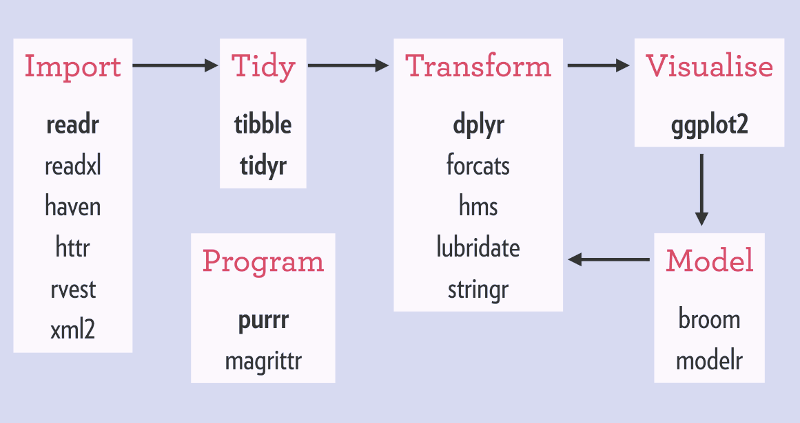
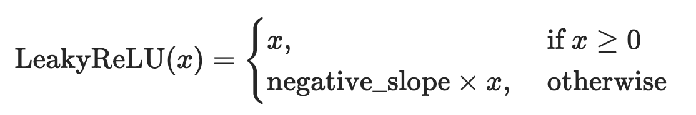

```{r}
#| echo: false
library(tidyverse)
```

## Course topics

1. Into the `tidyverse`
2. Logics with if-else statements and for-loops
3. Data manipulation with `tidyverse`
    - Data ingestion with `readr`
    - Pivotting dataframes with `tidyr`
    - Column manipulation with `dplyr`
4. Joining dataframes
5. Vectors and vectorisation in R

## AI usage disclosure

Parts of this presentation were created and supported by a quantised Qwen3.6-35B-A3B model, ran fully local on 12GB VRAM and 32GB RAM

No data were sent to any datacentres

Promote local AI!


# Into the `tidyverse`

## Into the `tidyverse`

- `tidyverse` is a **collection of R packages** built for data science
- Provide alternatives to base R functionalities  
- All packages shared the same principle of **tidy data**

## Into the `tidyverse`



## Into the `tidyverse`

- The main "unit" in `tidyverse` is a `tibble`
- A `tibble` is a similar to a dataframe in **base R**
- Difference:
  - `tibble` looks different when printed out
  - seamless integration with *every* function in the `tidyverse`
  - and more...

## Into the `tidyverse`

Difference between a `data.frame` and a `tibble`

:::: {.columns}
::: {.column}
```{r}
#| class-output: hscroll
mtcars
```
:::

::: {.column}
```{r}
#| class-output: hscroll
rownames_to_column(
  mtcars,
  var = "model"
) |>
  as_tibble()
```
:::
::::


## Tidy data

- A `tibble` is a table of rows and columns, following the principle of **tidy data**
- Each *column* is a *variable*
- Each *row* is an *observation*
- Each *cell* contains *1 value* only

## Tidy data

Which of these is a *tidy data* table

```{r}
#| echo: false
tibble::tribble(
  ~country  , ~code , ~"2015"    , ~"2016"   ,
  "Aruba"   , "ABW" , 28419.264  , 28449.713 ,
  "Albania" , "ALB" ,  3952.8036 ,  4124.055
)
```

or

```{r}
#| echo: false
tibble::tribble(
  ~country  , ~code , ~year , ~gdp       ,
  "Aruba"   , "ABW" ,  2015 , 28419.2645 ,
  "Aruba"   , "ABW" ,  2016 , 28449.713  ,
  "Albania" , "ALB" ,  2015 ,  3952.8036 ,
  "Albania" , "ALB" ,  2016 ,  4124.055  ,
)
```

## Tidy data

- R object type: `data.frame` or `tibble`
- Data structure: tidy or untidy data

## Why `tidyverse`?

::: {.callout-important}
### Takeaway points

1.  `tidyverse` is not a replacement of base R. **It is just a collection of R packages**
2.  You don't have to use `tidyverse` when using R
3.  `tidyverse` has most functions for data science needs. Though, there are times base R will be needed, and might be better/easier/faster
:::

## Into the `tidyverse` {.scrollable}

`tidyverse` functions that we will be using:

::: {.incremental style="font-size: 75%;"}
- `dplyr::select()` to select columns from a `tibble`
- `dplyr::mutate()` to modify and create columns in a `tibble`
- `dplyr::*_join()` to join `tibble`s in a specified method
- `tidyr::pivot_longer()` to transform a `tibble` from wide to long format (less columns, more rows)
- `tidyr::pivot_wider()` to transform a `tibble` from long to wide format (less rows, more columns)
- `purrr::map()` to performing vectorisation of function on vectors in R
:::


## Refresher: Piping in R

::: {.incremental}
- Pipes pass the result from the left-hand side as the **first argument** of the function on the right-hand side
- Structure: `data |> function(extra_arguments)`

- Replaces deeply nested function calls like `sqrt(mean(log(data, 2), na.rm = TRUE))` with readable, left-to-right chains
  - e.g. `data |> log(2) |> mean(na.rm = TRUE) |> sqrt()`
:::

## Refresher: Piping in R

- Since R 4.1.0, there is a native pipe operator: `|>`
- In the `tidyverse`, the pipe operator is `%>%`

::: {.callout-note}
`|>` and `%>%` are functionally similar with very small technical differences

Use whichever you like more
:::

- RStudio shortcut: **Cmd+Shift+M** (Mac) or **Ctrl+Shift+M** (Linux/Windows)


# Programming logics in R

## If-else

- You can write *conditional* logics in R
- *Conditional* logic: depending on the outcome of a test, execute a specific statement

```{.r}
if (logical statement) {
    do this
} else {
    do that
}
```

## If-else

- Logic statements are any statement (piece of R code) that provides a `TRUE` or `FALSE` result (also known as a **boolean** value)

```{r}
24 < 50 # This is a logic statement
TRUE & FALSE # This is also a logic statement
"R programming" == "fun" # Still a logic statement
TRUE # Believe it or not, still a logic statement
100 %in% seq(50, 120, 2) # Also logic statement
```


## If-else

- Example:

```{r}
x <- 10

if (x == 10) {
  print("x is 10")
} else {
  print("x is not 10")
}
```

## If-else

- You can infinitely* add more "branches" to if-else with `else if`

```{.r}
if (logical statement 1) {
    do this
} else if (logical statement 2) {
    do that
} else if (logical statement 3) {
    do something different
} else {
    do something other thing
}
```

::: {style="margin-top: 5em; font-size: x-large;"}
*: it is technically possible, no one is stopping you, but of course you should not add too much `else if`s to keep your code is [readable]{.underline} and [understandable]{.underline}
:::

## If-else

- Example:

```{r}
x <- 24

if (x < 10) {
  print("x is less than 10")
} else if (x < 20) {
  print("x is greater than 10 and less than 20")
} else if (x < 30) {
  print("x is greater than 20 and less than 30")
} else {
  print("x is greater or equal to 30")
}
```

## If-else

- Another example:

```{r}
target_year <- 2025

if (
  (target_year %% 4 == 0 & target_year %% 100 != 0) ||
    (target_year %% 400 == 0)
) {
  print(paste0(target_year, " is a leap year."))
} else {
  print(paste0(target_year, " is not a leap year."))
}
```

## If-else

- You can assign the resulting value to a variable:

```{r}
x <- 24

y <- if (x < 10) {
  "x is less than 10"
} else if (x < 20) {
  "x is greater than 10 and less than 20"
} else if (x < 30) {
  "x is greater than 20 and less than 30"
} else {
  "x is greater or equal to 30"
}

print(y)
```


## If-else

- You may also stumble into `ifelse()`

```{r}
print(ifelse(x > 10, "x is larger than 10", "x is smaller than 10"))
```

- It is a **vectorised** version of the typical `if (...) {...} else {...}` structure
- That means, you need a **vector** of conditions.

::: {.callout-tip}
We will cover **vectors** and **vectorisation** in R soon!
:::

## For-loop

- Imagine that you have to repeat the same analysis for many files that are all in the same folder on your computer
- A solution for that might be an iterative construct like a for-loop:

```{.r}
files <- dir()

for (filename in files) {
    infile <- read.table(filename, ...)
    
    outfile <- some_function(infile)

    return(outfile)
}
```

## For-loop

- An simple example simulating $R_0$:

```{r}
vec <- rep(0, 50) # create a vector of 50 zeroes, representing time steps
vec[1] <- 2 # reassign the first zero as 2, starting number of infectious
r0 <- 1.5 # basic reproduction number R_0

# loop from the 2nd time step to the end of vector
for (i in 2:length(vec)) {
  # get the number of infectious at current time step (starting at 2)
  vec[i] <- vec[i - 1] * r0
}

vec
```

## For-loop
```{r}
#| fig-align: center
plot(vec)
lines(vec)
```

## Conditionals within for-loops {.smaller .scrollable}

::: {.incremental}
- Let's combine if-else conditional logics with for-loops!

- Below is the code to calculate the "Leaky ReLU" function from -10 to 10

  - Original math notation: 

  - Code in R:

::: {.fragment}
```{r}
vec <- seq(-10, 10)
neg_slope <- 0.01

for (i in 1:length(vec)) {
  x <- vec[i]
  if (x >= 0) {
    vec[i] <- x
  } else {
    vec[i] <- x * neg_slope
  }
}

vec
```
:::
:::


## Conditionals within for-loops

```{r}
#| fig-align: center
plot(vec)
lines(vec)
```


## Summary {.smaller}

::: {.incremental}
- **If-else**: Conditional execution — execute different code blocks depending on `TRUE`/`FALSE` conditions
  - Can have multiple branching conditions with `else if {}`
  - Can assign the result to a variable
  - **`ifelse()`**: A **vectorised** version of `if-else` that operates on a **vector** of conditions
- **For-loops**: Iteratively repeat the same operation over a collection of elements (i.e. a **vector**)
- **Combining conditionals and loops**: Using `if-else` inside `for`-loops to apply logic per-iteration (e.g., implementing the Leaky ReLU activation function)
:::


# Data manipulation with `tidyverse`

## Data ingestion


## Data ingestion

::: {.incremental}
- Data comes in different formats (e.g. `.xlsx`, `.csv`, `.tsv`)
- `readr` is a package for reading **tabular text data**
- `readxl` is a package specifically for reading Excel files
- Both packages automatically read the data into a `tibble`
:::

## Data ingestion {.scrollable}

- Create a new R script
- Import `tidyverse`
- Load the [`covid_cases.csv`](https://raw.githubusercontent.com/OUCRU-Modelling/R-training-2025/refs/heads/main/slides/data/covid_cases.csv) data

```{r}
#' install.packages("tidyverse")
library(tidyverse)

covid_cases <- read_csv("data/covid_cases.csv")

#' check if `covid_cases` is a tibble
#' (`read_csv()` is part of the `tidyverse` so it automatically
#' converts the dataset into a `tibble`)
is_tibble(covid_cases)

covid_cases
```


## Data ingestion {.scrollable}

- You can quickly skim at the data using the `skimr` package

```{r}
# install.packages("skimr")
skimr::skim(covid_cases)
```

## Pivot `tibble`s {.scrollable}

- Does the data follow the *tidy data* principle?
```{r}
covid_cases
```

:::{.fragment}
- What do we want? Less columns more rows -> We want to pivot it **longer**
:::

## Pivot `tibble`s

- Let's use `pivot_longer()` to turn our data into tidy data

::: {.fragment}
```{r}
covid_cases <- covid_cases |>
  pivot_longer(
    cols = -date,
    names_to = "country",
    names_pattern = "cases_(.+)",
    values_to = "cases"
  )
covid_cases
```
:::


## Pivot `tibble`s {.scrollable}

- Now that the data is a tidy data `tibble`, let's take a look at it again

::: {.fragment}
```{r}
skimr::skim(covid_cases)
```
:::


## Select columns

- You can select columns from a `tibble` with `select()`

```{r}
covid_cases |> select(country, cases)
```

## Select columns

- You can *unselect* columns with the `-` operator
```{r}
covid_cases |>
  select(-country)

covid_cases |>
  select(-cases)
```


# Joining dataframes

## Before we start

Use the [`Titanic3`](https://raw.githubusercontent.com/OUCRU-Modelling/R-training-2025/refs/heads/main/slides/data/Titanic3.xlsx) dataset

```{r}
# install.packages("readxl")
library(readxl)
titanic_df <- read_excel("data/Titanic3.xlsx")
```

## Create and/or modify columns {.scrollable}

- You can create new columns or modify existing columns with `mutate()`
- Example: modify columns to their correct data type and create a new column for year of birth

```{r}
titanic_df |>
  select(pclass, survived, sex, age) |>
  mutate(
    pclass = as.factor(pclass),
    survived = as.factor(survived),
    sex = as.factor(sex),
    age = as.numeric(age),
    yob = 1912 - age
  )
```

## Create and/or modify columns {.scrollable}

- You can also work on the same column multiple times in one `mutate()`, the modifications will be run sequentially

```{r}
titanic_df |>
  select(pclass, survived, sex, age) |>
  mutate(
    pclass = as.factor(pclass),
    survived = as.factor(survived),
    sex = as.factor(sex),
    age = as.numeric(age),
    age = round(age),
    yob = 1912 - age
  )
```

## Create and/or modify columns {.scrollable}

- To run the same function for multiple columns, you can use `across()`
```{r}
titanic_df |>
  select(pclass, survived, sex, age) |>
  mutate(
    across(c(pclass, survived, sex), as.factor),
    age = as.numeric(age),
    age = round(age),
    yob = 1912 - age
  )
```

## Create and/or modify columns {.scrollable}

- To simply rename columns, you can use `rename()`

```{r}
titanic_df |> rename(passenger_class = pclass)
```

## Joining `tibble`s


## Joining `tibble`s

- Example: you have a `tibble` that maps the passenger class to its ticket name
```{r}
pclass_names <- tribble(
  ~pclass , ~name         ,
  "1st"   , "First class" ,
  "2nd"   , "Business"    ,
  "3rd"   , "Economy"
)

pclass_names
```


## Joining `tibble`s {.scrollable}

- Now, for that to be a new column of the dataset, you can **join** the `tibble`s
- ... but which type of join do we want to use?


## Joining `tibble`s

::: {.callout-important}
- Direction matters: the left `tibble` and right `tibble` are **not interchangable**
- Make sure the key columns exist on both `tibble`s
:::


## Joining 

- For our example, we will do a left join, where the original `tibble` is the left, and the passenger class name `tibble` is on the right
```{r}
titanic_df |>
  select(pclass, name) |>
  left_join(
    pclass_names,
    by = "pclass"
  )
```

## Summary 

:::{.r-fit-text}
Data science and analysis workflow with `tidyverse`:

- **Data ingestion**: `readr` and `readxl` read tabular data (CSV, Excel) into `tibble` objects; `skimr` provides a quick data overview
- **Reshaping**: `pivot_longer()` converts wide-format data to tidy (long) format by collapsing multiple columns into key-value pairs
- **Column operations**: `mutate()` creates or modifies columns; `rename()` renames columns; `select()` subsets columns (use `-` to drop)
- **Joining**: `left_join()` merges tibbles while preserving all rows from the left table; join direction and matching key columns are essential
:::


# Vectorise R functions

## What is a vector?

::: {.incremental}
-   A vector is a **container of elements of similar classes**
-   In math, $[1\space 2\space 3]$ is a vector of 3 integers
-   In R, you can define vectors by putting them inside `c()`
    -   `c(1, 2, 3)` is a vector of 3 `numeric` elements
    -   `c("ab", "cd", "ef")` is a vector of 3 `character` elements
    -   `c(c(1, 2), c(2, 3), c(3, 4))` is a vector of 3 `vector` elements, each is a vector of 2 `numeric` elements
:::

## What is a vector?

-   Question: is `12` a vector?

::: {.fragment}
```{r}
class(12)
class(c(12))
class(c(12, 13, 14))
```

-   In R, *most things* are vectors. A single number by itself is also a vector
-   `12` itself is a vector that has one numeric element
:::

## What is a vector?

::: {.incremental}
-   Conceptually, a `tibble` is a list of *named vectors*!
-   You can see it using the `str()` function
:::

::: {.fragment}
```{r}
# covid_cases <- readr::read_rds("data/covid_cases.rds") |>
#   pivot_longer(
#     cols = -date,
#     names_to = "country",
#     names_pattern = "cases_(.+)",
#     values_to = "cases"
#   )
str(covid_cases)
```
:::

::: {.fragment}
- `covid_cases` has 3 vectors:
  - `date` is a vector of dates
  - `country` is a vector of characters
  - `cases` is a vector of numbers
:::

## What is a vector?

- You can access vector elements with the `$` operator

```{r}
covid_cases$date[10000:10010]
covid_cases$country[10000:10010]
covid_cases$cases[10000:10010]
```

## What is a vector? {.scrollable}

- Or the `tidyverse` way with `dplyr::slice()` and `dplyr::pull()`

```{r}
covid_cases |> slice(10000:10010) |> pull(date)
covid_cases |> slice(10000:10010) |> pull(country)
covid_cases |> slice(10000:10010) |> pull(cases)
```

::: {.callout-note}
- one of the cases where using base R might be quicker and doesn't sacrifice readability
- [dplyr and tidyverse equivalents](https://dplyr.tidyverse.org/articles/base.html#one-table-verbs){target="_blank"}
:::

## Vectorisation {.scrollable}

::: {.incremental}
- Instead of going through each element and perform an action, we can *apply* an action to all elements at once
- Example: Take the square root of a vector
:::

::: {.fragment}
```{r}
data <- covid_cases$cases[10000:10010]

# before
data

squared_data <- numeric() # create new object to hold new data
idx <- seq(1, length(data)) # create index vector from 1 to the length of data
for (i in idx) {
  squared_data[i] <- data[i]^2
}

# after
squared_data
```

```{r}
# before
squared_data

# after
sqrt_data <- sqrt(squared_data)
sqrt_data

# alternative using `sapply()`
sqrt_data <- sapply(squared_data, sqrt)
sqrt_data
```

::: {.callout-note}
Most functions math-related functions and operators in base R are already vectorised, e.g. `sqrt()`, `log()`, `exp()`, `+`, `-`, `*`, `/`
:::
:::

## Vectorisation

- R has a **functional** style, which means vectorisation is more intuitive to write and read code
- On a technical level:
  - R itself *might be slightly* faster when doing vectorisation, compared to for-loops
  - for more complex and time-consuming functions, it is easier to **paralellise** with vectorisation


## Vectorisation

- Vectorisation shines when there are more complex actions, and you have to write your own functions
- Example: Assume that `data` is a vector of circle diameters, take its square roots and calculate the surface areas with vectorisation using `sapply()`

::: {.fragment}
```{r}
area_from_diameter <- function(d) {
  return(3.14 * (sqrt(d) / 2)^2)
}
sapply(data, area_from_diameter)
```
:::


## Vectorisation with `map()`

- In the `tidyverse`, we can perform vectorisation with the `purrr::map()` *family*
- Let's check how it works with `?purrr::map()`

::: {.fragment}
- Previous example using `map()`

```{r}
map(data, area_from_diameter) |> list_c()
```
:::

::: {.callout-note}
We do `list_c()` after a `map()` because `map()` is designed to take in a `list` and return a `list`. `list_c()` helps combine a list into a vector
:::

## Vectorisation with `map()`

- If you have 2 vectors that you want to go through at the same time, you can use `map2()`
- Example: `data2` is a vector of side lengths of squares, I want the sum of surface areas from the circles and the squares

::: {.fragment}
```{r}
data2 <- c(29, 37, 22, 35, 39, 29, 30, 33, 43, 36, 26)

some_fn <- function(d, l) {
  return(3.14 * (sqrt(d) / 2)^2) + (l^2)
}

map2(data, data2, some_fn) |> list_c()
```
:::

## Vectorisation with `map()` {.scrollable}

- You can create new columns, or edit current columns, with complex actions when using `map()` with `mutate()`
- Example: Using the `mtcars` dataset, create a new column called `hp_p_wt`, which is the horsepower per weight of each car **in kilograms**

::: {.fragment}
```{r}
some_other_fn <- function(h, w) {
  h / (w / 2.205)
}

mtcars |>
  mutate(
    hp_p_wt = map2(hp, wt, some_other_fn) |> unlist(),
    .before = mpg
  )
```
:::


