# Introduction

## What to expect

How to make an informative visual representation of data and/or results

-   **Part I**: process of graph creation
-   **Part II**: principles of graph interpretation

::: callout-note
*Graph* = diagram = chart = figure = picture
:::

## 

::: columns

::: {.column width="60%"}
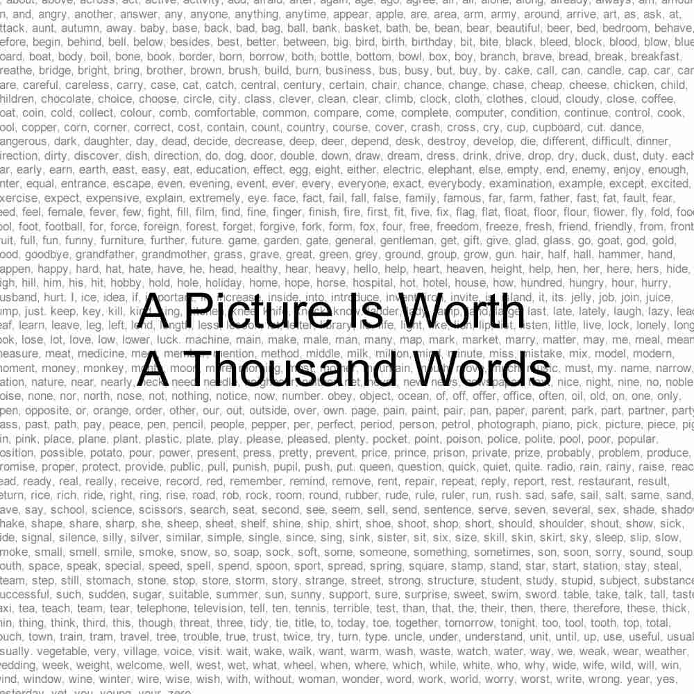{fig-align="left"}
:::

::: {.column .fragment width="40%"}
But it takes

-   knowledge of graphics principles
-   effort; trial and error
-   time

to make a "good" one
:::

:::

## Who created this graph?

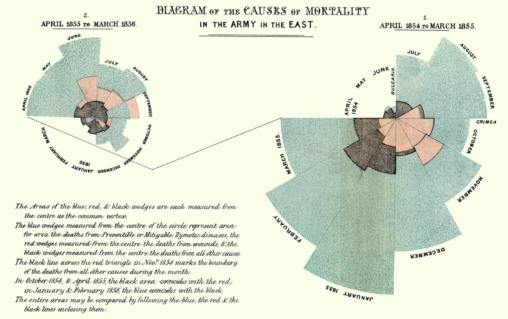{fig-align="center"}

## Answer: Florence Nightingale

Rose plot to convince UK authorities of importance of hygiene

{fig-align="center"}

## Example of informative graph

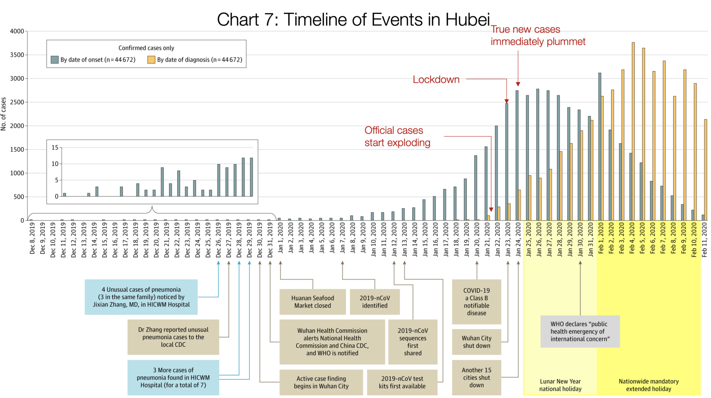{fig-align="center"}

## Example of noninformative graph {.smaller}

[Hinrichsen](https://pubmed.ncbi.nlm.nih.gov/11812878/): risk factors
for hepatitis G infection in haemodialysis patients

-   Do we need a graph?

    Are there enough data points to merit a plot?

    -   Depends on mode of presentation: conference lecture (time
        limit), article

-   If we use a graph, is this one the most truthful and informative?

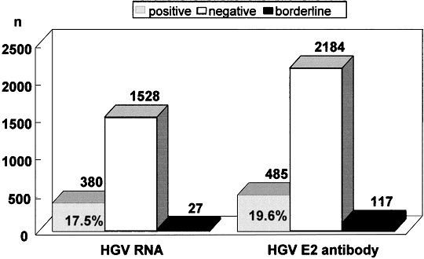{fig-align="center" width="300"}

## Graph versus table {.smaller}

Cohort study on 1187 HIV infected persons in The Gambia

::: columns

::: {.column width="20%"}
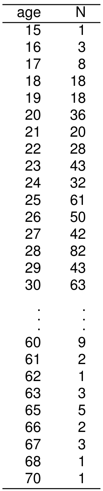{fig-align="center" width="60%"}
:::

::: {.column .fragment width="80%"}
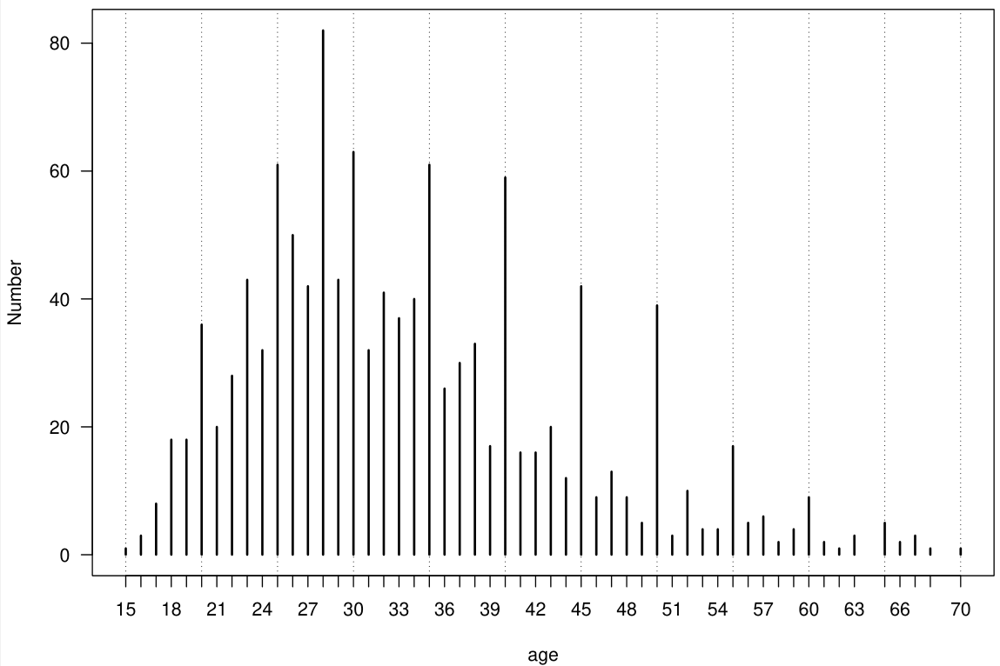{fig-align="center"}
:::
:::

## Pattern discovery (fake results)

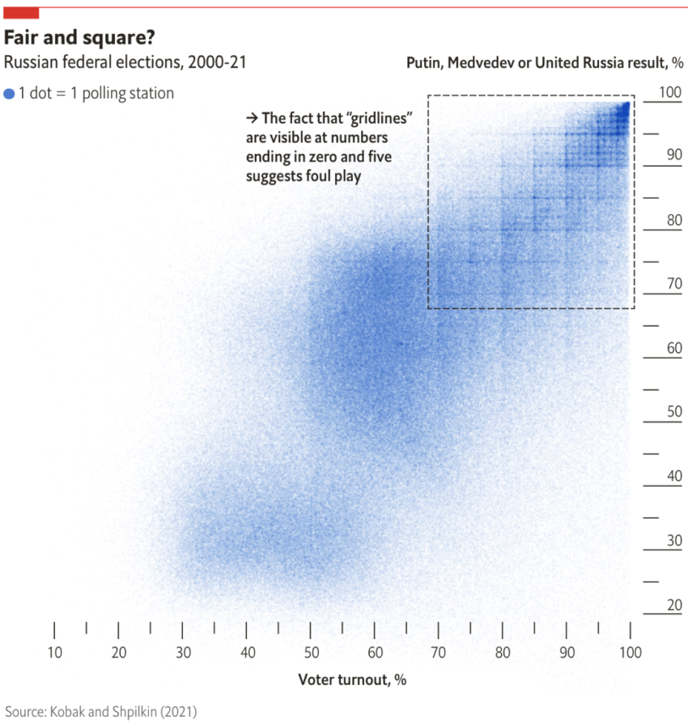{fig-align="center"}

## Points to consider
::: r-fit-text

-   [Why]{style="color:red;"} do we make a graph? (purpose)

    1.  We want to explore and inspect our data or results

    2.  Present data or results, often with a message, to others

::: fragment
-   [Where]{style="color:red;"} do we show the graph: research paper,
    conference, website
:::

::: fragment
-   [Who]{style="color:red;"} is the audience. Level of background
    knowledge
:::

::: fragment
-   [What]{style="color:red;"} do we want to show (data)

    -   Graph: visual representation of information ("encoding")

        mapping from data/results to figure
:::

:::
# The Grammar of Graphics

## The origin

::: columns
::: {.column width="60%"}
The author

-   Leland Wilkinson, *The Grammar of Graphics*, Springer 2005
-   Author of SYSTAT; 1995: sold to SPSS
-   1994 - 2007: Senior VP, SPSS
:::

::: {.column width="40%"}
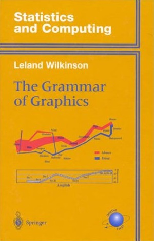{fig-align="center"}
:::
:::

## What is a grammar?

:::: {.columns}

::: {.column width="50%" .incremental}
-   Defines components of a sentence (verb, noun, ...) and rules how
    to combine them
-   Such a sentence *does not* necessarily have to make sense
-   **"The lab is flying menacingly"** (Subject + Conjugate + Verb + Adverb)
:::

::: {.column width="50%" .fragment style="text-align: center;"}
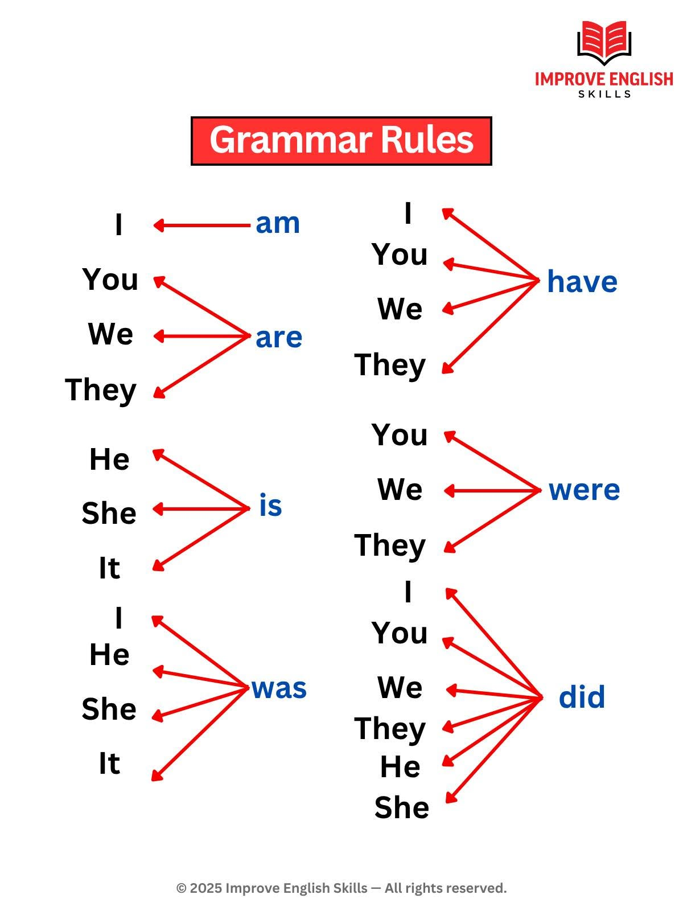{height="500" style="display: block; margin: 0 auto;"}
[E.g. this is one grammar rule of English]{style="font-size: x-large;"}
:::

::::

## What is a grammar?
-   **Graphics** grammar:
    -   Defines components of a figure and rules how to combine them
    -   Does not advise on the best choice of scale (linear,
        logarithmic), color or line type; one can create noninformative
        graphs

::: {.fragment .fade-in}
[Grammar helps expressing ideas or information in a clear and coherent way]{style="color: red;"}
:::

## Grammar of a graph

-   Mapping from information (data) to [aesthetic attributes]{.fragment fragment-index=1 .highlight-red} of [geometric objects]{.fragment fragment-index=1 .highlight-blue}
-   [Aesthetic attributes]{.fragment fragment-index=1 .highlight-red} are the "role" of variables in plot: location (often along x-axis and y-axis), colour, size, shape
-   [Geometric objects]{.fragment fragment-index=1 .highlight-blue} are what you see on the plot (points, lines, bars)

## Scatter plot

::: columns
::: {.column width="50%"}

:::

::: {.column width="50%"}
-   "Mapping routine measles vaccination in low-and middle-income
    countries." *Nature* 589, no. 7842 (2021): 415-419. (IF 2023 =
    50.5).

-   How do you read this plot?
:::
:::

## Scatter plot

::: columns

::: {.column width="50%"}

:::

:::{.column width="50%"}
What information would you need to map each dot correctly onto this
plot?

::: incremental
-   Country name
-   Position
-   Size
-   Color
:::
:::

:::

## Data {.smaller}

+------------+------------+------------+------------+-------------+
| label      | x          | y          | size       | color       |
|            |            |            |            |             |
| (country)  | (coverage) | (i         | (p         | (region)    |
|            |            | nequality) | opulation) |             |
+============+============+============+============+=============+
| Nigeria    | 0.20       | -0.07      | 220M       | Sub-Saharan |
|            |            |            |            | Africa      |
+------------+------------+------------+------------+-------------+

Data found here:
[nature_plot.xlsx](https://github.com/OUCRU-Modelling/R-training-2025/raw/refs/heads/main/slides/data/nature_plot.xlsx)

```{r}
#| echo: FALSE
library(readxl)
df <- read_excel("data/nature_plot.xlsx")
head(df)
```

## Scatter plot

::: columns
::: {.column width="50%"}

:::

::: {.column width="50%"}
Let's draw this by hand
:::
:::

## Draw this by hand

::: columns
::: {.column width="50%"}

:::

::: {.column width="50%"}
-   Draw the axes
-   Draw the data points
-   Adjust dot sizes
-   Colour-code the regions
-   Add key country labels
:::
:::

# We draw this by using...

# `ggplot2`

Use the **Grammar of Graphics** to create elegant data visualisations

::: {.codewindow .r}

code.R
```{r}
#| warning: FALSE
#| message: FALSE
library(ggplot2)
```

:::

## Draw the axes {.smaller}

::: columns

::: {.column width="60%"}
::: {.codewindow .r}

code.R
```{r}
#| eval: FALSE
# df <- ...
ggplot(
  data = df,
  mapping = aes(x = coverage, y = inequality)
)
```

:::

::: {.fragment}
➡ The `x` and `y` aesthetics determine which variable is drawn on each axis. 
:::
:::

::: {.column width="40%"}
```{r}
#| echo: FALSE
#| fig-width: 5
#| fig-height: 5
#| out-width: "100%"
ggplot(data = df, mapping = aes(x = coverage, y = inequality))
```

:::
:::

## Draw the data points {.smaller}

::: columns

::: {.column width="60%"}
::: {.codewindow .r}
code.R

```{r}
#| eval: FALSE
#| code-line-numbers: "2"
ggplot(data = df, mapping = aes(x = coverage, y = inequality)) +
  geom_point()
```

:::
:::

::: {.column width="40%"}
```{r}
#| echo: FALSE
#| fig-width: 5
#| fig-height: 5
#| out-width: "100%"
ggplot(data = df, mapping = aes(x = coverage, y = inequality)) +
  geom_point()
```

:::
:::


## Changing the plot orientation {.smaller}


::: columns

::: {.column width="60%"}
::: {.codewindow .r}
code.R

```{r}
#| eval: FALSE
#| code-line-numbers: "1"
ggplot(data = df, mapping = aes(x = inequality, y = coverage)) +
  geom_point()
```

:::
::: {.fragment}
Swapping `x` and `y` aesthetics will change the plot orientation
:::
:::

::: {.column width="40%"}
```{r}
#| echo: FALSE
#| fig-width: 5
#| fig-height: 5
#| out-width: "100%"
ggplot(df, aes(x = inequality, y = coverage)) +
  geom_point()
```
:::

:::

## Adjust dot sizes {.smaller}

::: columns
::: {.column width="60%"}
::: {.codewindow .r}
code.R

```{r}
#| eval: FALSE
#| code-line-numbers: "2"
ggplot(data = df, mapping = aes(x = coverage, y = inequality)) +
  geom_point(mapping = aes(size = pop))
```

:::
::: {.fragment}
Observe the 2 `mapping` argument calls, one in `ggplot()` and one in `geom_point()`
:::
:::

::: {.column width="40%"}
```{r}
#| echo: FALSE
#| fig-width: 5
#| fig-height: 5
#| out-width: "100%"
ggplot(df, aes(x = coverage, y = inequality)) +
  geom_point(aes(size = pop))
```
:::
:::

## Colour-code the regions {.smaller}

::: columns
::: {.column width="60%"}
::: {.codewindow .r}
code.R

```{r}
#| eval: FALSE
#| code-line-numbers: "2"
ggplot(data = df, mapping = aes(x = coverage, y = inequality)) +
  geom_point(mapping = aes(size = pop, color = region))
```
:::
:::

::: {.column width="40%"}
```{r}
#| echo: FALSE
#| fig-width: 5
#| fig-height: 5
#| out-width: "100%"
ggplot(df, aes(x = coverage, y = inequality)) +
  geom_point(aes(size = pop, color = region))
```
:::
:::

## Add key country labels {.smaller}

::: columns
::: {.column width="60%"}
::: {.codewindow .r}
code.R

```{r}
#| eval: FALSE
#| code-line-numbers: "3"
ggplot(data = df, mapping = aes(x = coverage, y = inequality)) +
  geom_point(mapping = aes(size = pop, color = region)) +
  geom_text(mapping = aes(label = country))
```
:::
:::

::: {.column width="40%"}
```{r}
#| echo: FALSE
#| fig-width: 5
#| fig-height: 5
#| out-width: "100%"
ggplot(df, aes(x = coverage, y = inequality)) +
  geom_point(aes(size = pop, color = region)) +
  geom_text(aes(label = country))
```
:::
:::

## Compare with the original figure {.smaller}

::: columns
::: {.column width="50%"}
Original figure

:::

::: {.column width="50%"}
Ours (so far)
```{r}
#| echo: FALSE
#| fig-width: 5
#| fig-height: 5
#| out-width: "100%"
ggplot(df, aes(x = coverage, y = inequality)) +
  geom_point(aes(size = pop, color = region)) +
  geom_text(aes(label = country))
```
:::
:::

## Grammar of a graph

-   Mapping from information (data) to [aesthetic attributes]{style="color: red;"} of [geometric objects]{style="color: blue;"}
-   [Aesthetic attributes]{style="color: red;"} are the "role" of variables in plot: location (often along x-axis and y-axis), colour, size, shape
-   [Geometric objects]{style="color: blue;"} are what you see on the plot (points, lines, bars)

:::{.fragment}
-   [Scales]{style="color: orange;"} defines the range and values of an [aesthetic]{style="color: red;"}
:::

## Scales
-   E.g. The limits and breaks of the x-axis and y-axis
-   It *may* also include statistical transformation(s)

## Scales: statistical transformation

-   **Value transformation** (e.g. linear scale -> logarithm scale)

-   Each **bar in a histogram** can be a "sum" or a "percentage/frequency", depending on the (optional) statistical transformation applied

-   A Least Square **Regression line** can be fitted before plotting, this also counts as a statistical transformation

## Scales: statistical transformation

**Note**: statistical transformation on the scales [do not]{style="color: red;"} change the data, just how we "observe" it

## Scales

-   Position on x-axis and on y-axis
-   It *may* be a value after statistical transformation

-   ::: columns
    ::: {.column width="50%"}
    Rest: via colour,

    shape (type of point),

    linetype,

    point size
    :::

    ::: {.column width="50%"}
    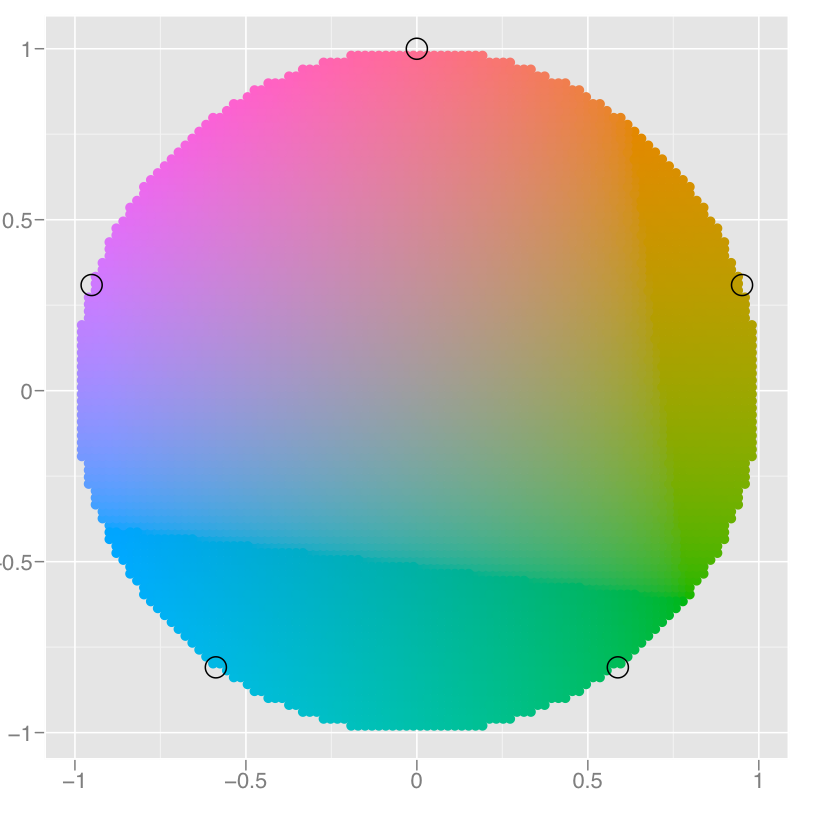{width="50%"}
    :::
    :::

-   Reading values from the graph via **guides**: tick marks and labels,
    legend
    
## Refine the plot: scale color {.smaller}
Default

::: columns

::: {.column width="50%"} 
::: {.codewindow .r}
code.R

```{r default 1}
#| eval: FALSE
#| code-line-numbers: false
ggplot(df, aes(x = coverage, y = inequality)) +
  geom_point(aes(size = pop, color = region)) +
  geom_text(aes(label = country))
```
:::
:::

::: {.column width="50%"}
```{r default 2}
#| echo: FALSE
#| fig-width: 5.6
#| fig-height: 6.7
#| out-width: "100%"
ggplot(df, aes(x = coverage, y = inequality)) +
  geom_point(aes(size = pop, color = region)) +
  geom_text(aes(label = country))
```
:::
:::

## Refine the plot: scale color {.smaller}
Built-in color palette

::: columns

::: {.column width="50%"}
::: {.codewindow .r}
code.R

```{r builtin 1}
#| eval: FALSE
#| code-line-numbers: "4-6"
ggplot(df, aes(x = coverage, y = inequality)) +
  geom_point(aes(size = pop, color = region)) +
  geom_text(aes(label = country)) +
  scale_color_discrete(
    palette = scales::pal_viridis()
  )
```
:::
:::

::: {.column width="50%"}
```{r builtin 2}
#| echo: FALSE
#| fig-width: 5.6
#| fig-height: 6.7
#| out-width: "100%"
ggplot(df, aes(x = coverage, y = inequality)) +
  geom_point(aes(size = pop, color = region)) +
  geom_text(aes(label = country)) +
  scale_color_discrete(
    palette = scales::pal_viridis()
  )
```
:::
:::


## Refine the plot: scale color {.smaller}
Custom color palette

::: columns
::: {.column width="50%"}
::: {.codewindow .r}
code.R

```{r custom 1}
#| eval: FALSE
#| code-line-numbers: "1-8|13"
cols <- c(
  "Central Europe, Eastern Europe and Central Asia" = "#fa8495",
  "Latin America and Caribbean" = "#4ca258",
  "North Africa and Middle East" = "#6493bb",
  "South Asia" = "#d7c968",
  "Southeast Asia, East Asia and Oceania" = "#7dd8f3",
  "Sub-Saharan Africa" = "#bc5c91"
)

ggplot(df, aes(x = coverage, y = inequality)) +
  geom_point(aes(size = pop, color = region)) +
  geom_text(aes(label = country)) +
  scale_color_manual(values = cols)
```
:::
:::

::: {.column width="50%"}
```{r custom 2}
#| echo: FALSE
#| fig-width: 5.6
#| fig-height: 6.7
#| out-width: "100%"
cols <- c(
  "Central Europe, Eastern Europe and Central Asia" = "#fa8495",
  "Latin America and Caribbean" = "#4ca258",
  "North Africa and Middle East" = "#6493bb",
  "South Asia" = "#d7c968",
  "Southeast Asia, East Asia and Oceania" = "#7dd8f3",
  "Sub-Saharan Africa" = "#bc5c91"
)

ggplot(df, aes(x = coverage, y = inequality)) +
  geom_point(aes(size = pop, color = region)) +
  geom_text(aes(label = country)) +
  scale_color_manual(values = cols)
```
:::
:::

## Refine the plot: scale size {.smaller}

::: columns
::: {.column width="50%"}
::: {.codewindow .r}
code.R

```{r}
#| eval: FALSE
#| code-line-numbers: "16-22"
cols <- c(
  "Central Europe, Eastern Europe and Central Asia" = "#fa8495",
  "Latin America and Caribbean" = "#4ca258",
  "North Africa and Middle East" = "#6493bb",
  "South Asia" = "#d7c968",
  "Southeast Asia, East Asia and Oceania" = "#7dd8f3",
  "Sub-Saharan Africa" = "#bc5c91"
)

ggplot(df, aes(x = coverage, y = inequality)) +
  geom_point(aes(size = pop, color = region)) +
  geom_text(aes(label = country)) +
  scale_color_manual(
    values = cols,
    guide = guide_legend(order = 2)
  ) +
  scale_size_continuous(
    breaks = c(50, 100, 150, 200),
    labels = c("50 million", "100 million", "150 million", "200 million"),
    range = c(0, 8),
    guide = guide_legend(order = 1)
  )
```
:::
:::

::: {.column width="50%"}
```{r}
#| echo: FALSE
#| fig-width: 5.6
#| fig-height: 6.7
#| out-width: "100%"
cols <- c(
  "Central Europe, Eastern Europe and Central Asia" = "#fa8495",
  "Latin America and Caribbean" = "#4ca258",
  "North Africa and Middle East" = "#6493bb",
  "South Asia" = "#d7c968",
  "Southeast Asia, East Asia and Oceania" = "#7dd8f3",
  "Sub-Saharan Africa" = "#bc5c91"
)

ggplot(df, aes(x = coverage, y = inequality)) +
  geom_point(aes(size = pop, color = region)) +
  geom_text(aes(label = country)) +
  scale_size_continuous(
    breaks = c(50, 100, 150, 200),
    labels = c("50 million", "100 million", "150 million", "200 million"),
    range = c(0, 8),
    guide = guide_legend(order = 1)
  ) +
  scale_color_manual(
    values = cols,
    guide = guide_legend(order = 2)
  )
```
:::
:::

## Refine the plot: scale axes {.smaller}

::: columns
::: {.column width="50%"}
::: {.codewindow .r}
code.R

```{r}
#| eval: FALSE
#| code-line-numbers: "23-30"
cols <- c(
  "Central Europe, Eastern Europe and Central Asia" = "#fa8495",
  "Latin America and Caribbean" = "#4ca258",
  "North Africa and Middle East" = "#6493bb",
  "South Asia" = "#d7c968",
  "Southeast Asia, East Asia and Oceania" = "#7dd8f3",
  "Sub-Saharan Africa" = "#bc5c91"
)

ggplot(df, aes(x = coverage, y = inequality)) +
  geom_point(aes(size = pop, color = region)) +
  geom_text(aes(label = country)) +
  scale_color_manual(
    values = cols,
    guide = guide_legend(order = 2)
  ) +
  scale_size_continuous(
    breaks = c(50, 100, 150, 200),
    labels = c("50 million", "100 million", "150 million", "200 million"),
    range = c(0, 8),
    guide = guide_legend(order = 1)
  ) +
  scale_x_continuous(
    breaks = c(-0.25, 0, 0.25, 0.5),
    limits = c(-0.4, 0.55)
  ) +
  scale_y_continuous(
    breaks = c(-0.1, 0, 0.1),
    limits = c(-0.16, 0.1)
  )
```
:::
:::

::: {.column width="50%"}
```{r}
#| echo: FALSE
#| fig-width: 5.6
#| fig-height: 6.7
#| out-width: "100%"
cols <- c(
  "Central Europe, Eastern Europe and Central Asia" = "#fa8495",
  "Latin America and Caribbean" = "#4ca258",
  "North Africa and Middle East" = "#6493bb",
  "South Asia" = "#d7c968",
  "Southeast Asia, East Asia and Oceania" = "#7dd8f3",
  "Sub-Saharan Africa" = "#bc5c91"
)

ggplot(df, aes(x = coverage, y = inequality)) +
  geom_point(aes(size = pop, color = region)) +
  geom_text(aes(label = country)) +
  scale_x_continuous(breaks = c(-0.25, 0, 0.25, 0.5), limits = c(-0.4, 0.55)) +
  scale_y_continuous(breaks = c(-0.1, 0, 0.1), limits = c(-0.16, 0.1)) +
  scale_size_continuous(
    breaks = c(50, 100, 150, 200),
    labels = c("50 million", "100 million", "150 million", "200 million"),
    range = c(0, 8),
    guide = guide_legend(order = 1)
  ) +
  scale_color_manual(
    values = cols,
    guide = guide_legend(order = 2)
  )
```
:::
:::

## Refine the plot: theme and labels {.smaller}

::: columns
::: {.column width="50%"}
::: {.codewindow .r}
code.R

```{r}
#| eval: FALSE
#| code-line-numbers: "31-42"
cols <- c(
  "Central Europe, Eastern Europe and Central Asia" = "#fa8495",
  "Latin America and Caribbean" = "#4ca258",
  "North Africa and Middle East" = "#6493bb",
  "South Asia" = "#d7c968",
  "Southeast Asia, East Asia and Oceania" = "#7dd8f3",
  "Sub-Saharan Africa" = "#bc5c91"
)

ggplot(df, aes(x = coverage, y = inequality)) +
  geom_point(aes(size = pop, color = region)) +
  geom_text(aes(label = country)) +
  scale_color_manual(
    values = cols,
    guide = guide_legend(order = 2)
  ) +
  scale_size_continuous(
    breaks = c(50, 100, 150, 200),
    labels = c("50 million", "100 million", "150 million", "200 million"),
    range = c(0, 8),
    guide = guide_legend(order = 1)
  ) +
  scale_x_continuous(
    breaks = c(-0.25, 0, 0.25, 0.5),
    limits = c(-0.4, 0.55)
  ) +
  scale_y_continuous(
    breaks = c(-0.1, 0, 0.1),
    limits = c(-0.16, 0.1)
  ) +
  labs(
    x = "Change in MCV1 coverage (2019-2000)",
    y = "Change in absolute geographical inequality (2019-2000)",
    size = NULL,
    color = NULL
  ) +
  theme_classic() +
  theme(
    legend.position = "top",
    legend.direction = "vertical",
    legend.text = element_text(size = 11),
    legend.key.height = unit(0.5, "cm"),
    axis.text = element_text(size = 11)
  )
```
:::
:::

::: {.column width="50%"}
```{r}
#| echo: FALSE
#| fig-width: 5.6
#| fig-height: 6.7
#| out-width: "100%"
cols <- c(
  "Central Europe, Eastern Europe and Central Asia" = "#fa8495",
  "Latin America and Caribbean" = "#4ca258",
  "North Africa and Middle East" = "#6493bb",
  "South Asia" = "#d7c968",
  "Southeast Asia, East Asia and Oceania" = "#7dd8f3",
  "Sub-Saharan Africa" = "#bc5c91"
)

ggplot(df, aes(x = coverage, y = inequality)) +
  geom_point(aes(size = pop, color = region)) +
  geom_text(aes(label = country)) +
  scale_color_manual(
    values = cols,
    guide = guide_legend(order = 2)
  ) +
  scale_size_continuous(
    breaks = c(50, 100, 150, 200),
    labels = c("50 million", "100 million", "150 million", "200 million"),
    range = c(0, 8),
    guide = guide_legend(order = 1)
  ) +
  scale_x_continuous(
    breaks = c(-0.25, 0, 0.25, 0.5),
    limits = c(-0.4, 0.55)
  ) +
  scale_y_continuous(
    breaks = c(-0.1, 0, 0.1),
    limits = c(-0.16, 0.1)
  ) +
  labs(
    x = "Change in MCV1 coverage (2019-2000)",
    y = "Change in absolute geographical inequality (2019-2000)",
    size = NULL,
    color = NULL
  ) +
  theme_classic() +
  theme(
    legend.position = "top",
    legend.direction = "vertical",
    legend.text = element_text(size = 11),
    legend.key.height = unit(0.5, "cm"),
    axis.text = element_text(size = 11)
  )
```
:::
:::


## Refine the plot: minor tweaks {.smaller}

::: columns
::: {.column width="50%"}
::: {.codewindow .r}
code.R

```{r}
#| eval: FALSE
#| code-line-numbers: false
cols <- c(
  "Central Europe, Eastern Europe and Central Asia" = "#fa8495",
  "Latin America and Caribbean" = "#4ca258",
  "North Africa and Middle East" = "#6493bb",
  "South Asia" = "#d7c968",
  "Southeast Asia, East Asia and Oceania" = "#7dd8f3",
  "Sub-Saharan Africa" = "#bc5c91"
)

ggplot(df, aes(x = coverage, y = inequality)) +
  geom_point(aes(size = pop, color = region), alpha = 0.8) +
  geom_text(aes(label = country), hjust = -0.2, vjust = 0.2) +
  geom_vline(xintercept = 0, color = "#999999") +
  geom_hline(yintercept = 0, color = "#999999") +
  scale_color_manual(
    values = cols,
    guide = guide_legend(order = 2)
  ) +
  scale_size_continuous(
    breaks = c(50, 100, 150, 200),
    labels = c("50 million", "100 million", "150 million", "200 million"),
    range = c(0, 8),
    guide = guide_legend(order = 1)
  ) +
  scale_x_continuous(
    breaks = c(-0.25, 0, 0.25, 0.5),
    limits = c(-0.4, 0.55)
  ) +
  scale_y_continuous(
    breaks = c(-0.1, 0, 0.1),
    limits = c(-0.16, 0.1)
  ) +
  labs(
    x = "Change in MCV1 coverage (2019-2000)",
    y = "Change in absolute geographical inequality (2019-2000)",
    size = NULL,
    color = NULL
  ) +
  theme_classic() +
  theme(
    legend.position = "top",
    legend.direction = "vertical",
    legend.text = element_text(size = 11),
    legend.key.height = unit(0.5, "cm"),
    axis.text = element_text(size = 11)
  )
```
:::
:::

::: {.column width="50%"}
```{r}
#| echo: FALSE
#| fig-width: 5.6
#| fig-height: 6.7
#| out-width: "100%"
cols <- c(
  "Central Europe, Eastern Europe and Central Asia" = "#fa8495",
  "Latin America and Caribbean" = "#4ca258",
  "North Africa and Middle East" = "#6493bb",
  "South Asia" = "#d7c968",
  "Southeast Asia, East Asia and Oceania" = "#7dd8f3",
  "Sub-Saharan Africa" = "#bc5c91"
)

ggplot(df, aes(x = coverage, y = inequality)) +
  geom_point(aes(size = pop, color = region), alpha = 0.8) +
  geom_text(aes(label = country), hjust = -0.2, vjust = 0.2) +
  geom_vline(xintercept = 0, color = "#999999") +
  geom_hline(yintercept = 0, color = "#999999") +
  scale_x_continuous(breaks = c(-0.25, 0, 0.25, 0.5), limits = c(-0.4, 0.55)) +
  scale_y_continuous(breaks = c(-0.1, 0, 0.1), limits = c(-0.16, 0.1)) +
  scale_size_continuous(
    breaks = c(50, 100, 150, 200),
    labels = c("50 million", "100 million", "150 million", "200 million"),
    range = c(0, 8),
    guide = guide_legend(order = 1)
  ) +
  scale_color_manual(
    values = cols,
    guide = guide_legend(order = 2)
  ) +
  labs(
    x = "Change in MCV1 coverage (2019-2000)",
    y = "Change in absolute geographical inequality (2019-2000)",
    size = NULL,
    color = NULL
  ) +
  theme_classic() +
  theme(
    legend.position = "top",
    legend.direction = "vertical",
    legend.text = element_text(size = 11),
    legend.key.height = unit(0.5, "cm"),
    axis.text = element_text(size = 11)
  )
```
:::
:::

## Refine the plot {.smaller}

::: columns
::: {.column width="50%"}

:::

::: {.column width="50%"}
```{r}
#| echo: FALSE
#| fig-width: 5.6
#| fig-height: 6.7
#| out-width: "100%"
cols <- c(
  "Central Europe, Eastern Europe and Central Asia" = "#fa8495",
  "Latin America and Caribbean" = "#4ca258",
  "North Africa and Middle East" = "#6493bb",
  "South Asia" = "#d7c968",
  "Southeast Asia, East Asia and Oceania" = "#7dd8f3",
  "Sub-Saharan Africa" = "#bc5c91"
)

# 1. Don't try to write and run everything at once
# 2. Add one small piece at a time
# 3. If something goes wrong, it's easier to fix

ggplot(df, aes(x = coverage, y = inequality)) +
  geom_point(aes(size = pop, color = region), alpha = 0.8) +
  geom_text(aes(label = country), hjust = -0.2, vjust = 0.2) +
  geom_vline(xintercept = 0, color = "#999999") +
  geom_hline(yintercept = 0, color = "#999999") +
  scale_x_continuous(breaks = c(-0.25, 0, 0.25, 0.5), limits = c(-0.4, 0.55)) +
  scale_y_continuous(breaks = c(-0.1, 0, 0.1), limits = c(-0.16, 0.1)) +
  scale_size_continuous(
    breaks = c(50, 100, 150, 200),
    labels = c("50 million", "100 million", "150 million", "200 million"),
    range = c(0, 8),
    guide = guide_legend(order = 1)
  ) +
  scale_color_manual(
    values = cols,
    guide = guide_legend(order = 2)
  ) +
  labs(
    x = "Change in MCV1 coverage (2019-2000)",
    y = "Change in absolute geographical inequality (2019-2000)",
    size = NULL,
    color = NULL
  ) +
  theme_classic() +
  theme(
    legend.position = "top",
    legend.direction = "vertical",
    legend.text = element_text(size = 11),
    legend.key.height = unit(0.5, "cm"),
    axis.text = element_text(size = 11)
  )
```
:::
:::

## Some frequently used `geom_*`

::: {.r-fit-text .scrolling style="height: 450px; padding:10px;overflow-y:scroll"}
Histogram and bar charts

+---------------------+-----------------------------------+-------------------------------+
| `geom_*`            | Description                       | Parameters                    |
+=====================+===================================+===============================+
| `geom_histogram()`  | Divide continuous `x` into bins   | Required: `x`                 |
|                     | and count observations.           | `bins` or `binwidth`          |
+---------------------+-----------------------------------+-------------------------------+
| `geom_col()`        | Bar chart using provided `x` and  | Required: `x`, `y`            |
|                     | `y` values.                       |                               |
+---------------------+-----------------------------------+-------------------------------+
| `geom_bar()`        | Bar chart with one axis computed  | Required: `x` or `y`          |
|                     | using `stat`.                     | `stat` (default: `"count"`)   |
+---------------------+-----------------------------------+-------------------------------+
:::

## Some frequently used `geom_*`

::: r-fit-text
**Example:** For the following examples, we will use the
[simulated_covid.rds](https://github.com/OUCRU-Modelling/R-training-2025/raw/refs/heads/main/slides/data/simulated_covid.rds)
dataset

```{r}
simulated_covid <- readRDS("data/simulated_covid.rds")

head(simulated_covid)
```
:::

## Some frequently used `geom_*`

::: r-fit-text
**Example:** creating a bar chart for number of covid incidence over
time

::: columns
::: {.column width="50%"}
::: {.codewindow .r}
code.R

```{r eval=FALSE}
ggplot(
  data = simulated_covid,
  aes(x = date_onset)
) +
  geom_bar(
    color = "cornflowerblue"
  ) +
  labs(
    title = "New covid cases over time",
    x = "Date",
    y = "Number of cases"
  )
```
:::
:::

::: {.column width="50%"}
```{r echo=FALSE}
#| fig-width: 5
#| fig-height: 5
#| out-width: "100%"
ggplot(
  data = simulated_covid,
  aes(x = date_onset)
) +
  geom_bar(
    color = "cornflowerblue"
  ) +
  labs(
    title = "New covid cases over time",
    x = "Date",
    y = "Number of cases"
  )
```
:::
:::

:::


## Some frequently used `geom_*`

::: r-fit-text
Scatter plot

+---------------+-------------------------------+---------------------+
| `geom_*`      | description                   | Parameters          |
+===============+===============================+=====================+
| `             | Create a scatter plot from    | Required aesthetic: |
| geom_point()` | given `x` and `y`             | `x` and `y`         |
+---------------+-------------------------------+---------------------+
:::

## Some frequently used `geom_*`

::: r-fit-text
**Example:** creating a scatter plot for number of covid incidence over
time

::: columns
::: {.column width="50%"}
::: {.codewindow .r}
code.R

```{r eval=FALSE}
library(dplyr)
# we need to compute y
# (case_count before plotting)
aggregated_cases <- simulated_covid |>
  group_by(date_onset) |>
  summarize(
    case_count = n()
  )

ggplot(
  aggregated_cases,
  aes(x = date_onset, y = case_count)
) +
  geom_point(
    color = "cornflowerblue"
  ) +
  labs(
    title = "New covid cases over time",
    x = "Date",
    y = "Number of cases"
  )
```
:::
:::

::: {.column width="50%"}
```{r echo=FALSE}
#| fig-width: 5
#| fig-height: 5
#| out-width: "100%"
library(dplyr)
# we need to compute y (case_count before plotting)
aggregated_cases <- simulated_covid |>
  group_by(date_onset) |>
  summarize(
    case_count = n()
  )

ggplot(
  aggregated_cases,
  aes(x = date_onset, y = case_count)
) +
  geom_point(
    color = "cornflowerblue"
  ) +
  labs(
    title = "New covid cases over time",
    x = "Date",
    y = "Number of cases"
  )
```
:::
:::

:::

## Some frequently used `geom_*`

::: r-fit-text
Line chart

+----------------+------------------+------------------------------------+
| `geom_*`       | description      | Parameters                         |
+================+==================+====================================+
| `geom_line()`  | Create a line    | Required aesthetic: `x` and `y`    |
|                | plot from given  |                                    |
|                | `x` and `y`      |                                    |
+----------------+------------------+------------------------------------+
| `geom_smooth()`| Create a         | Required aesthetic: `x` and `y`    |
|                | regression line  |                                    |
|                | plot from `x`    | -   `method`: select regression    |
|                | and `y`          |     model                          |
|                |                  |     (`"auto"`, `"                  |
|                |                  | lm"`, `"glm"`, `"gam"`, `"loess"`) |
|                |                  |                                    |
|                |                  | -   `formula`: adjust the formula  |
|                |                  |     for the regression model       |
+----------------+------------------+------------------------------------+
:::

## Some frequently used `geom_*`

::: r-fit-text
**Example:** creating a line chart for number of covid incidence over
time

::: columns

::: {.column width="50%"}
::: {.codewindow .r}
code.R

```{r eval=FALSE}
ggplot(
  aggregated_cases,
  aes(x = date_onset, y = case_count)
) +
  geom_line(
    color = "cornflowerblue"
  ) +
  labs(
    title = "New covid cases over time",
    x = "Date",
    y = "Number of cases"
  )
```
:::
:::

::: {.column width="50%"}
```{r echo=FALSE}
#| fig-width: 5
#| fig-height: 5
#| out-width: "100%"
ggplot(
  aggregated_cases,
  aes(x = date_onset, y = case_count)
) +
  geom_line(
    color = "cornflowerblue"
  ) +
  labs(
    title = "New covid cases over time",
    x = "Date",
    y = "Number of cases"
  )
```
:::
:::

:::

## Some frequently used `geom_*`

::: r-fit-text
**Example:** add a regression line for number of covid incidence over
time

::: columns

::: {.column width="50%"}
::: {.codewindow .r}
code.R

```{r eval=FALSE}
ggplot(
  aggregated_cases,
  aes(x = date_onset, y = case_count)
) +
  geom_point(
    color = "grey"
  ) +
  geom_smooth(
    color = "cornflowerblue",
    # choose gam model to fit the data
    method = "gam"
  ) +
  labs(
    title = "New covid cases over time",
    x = "Date",
    y = "Number of cases"
  )
```
:::
:::

::: {.column width="50%"}
```{r echo=FALSE}
#| fig-width: 5
#| fig-height: 5
#| out-width: "100%"
ggplot(
  aggregated_cases,
  aes(x = date_onset, y = case_count)
) +
  geom_point(
    color = "grey"
  ) +
  geom_smooth(
    color = "cornflowerblue",
    method = "gam" # choose gam model to fit the data
  ) +
  labs(
    title = "New covid cases over time",
    x = "Date",
    y = "Number of cases"
  )
```
:::
:::

:::

## Some frequently used `geom_*`

::: r-fit-text
Box plot

+-------------+----------------------------------------+--------------+
| `geom_*`    | description                            | Parameters   |
+=============+========================================+==============+
| `geom       | Create a boxplot from a continuous     | Required     |
| _boxplot()` | variable.                              | aesthetic:   |
|             |                                        | `x`          |
|             | If both `x` and `y` are given, one     | [**or**]     |
|             | must be a categorical variable (in     | {.underline} |
|             | which case a boxplot is created for    | `y`          |
|             | each category)                         |              |
+-------------+----------------------------------------+--------------+
:::

## Some frequently used `geom_*`

::: r-fit-text
**Example:** create a box plot to compare number of cases per day
between 2 outbreaks

::: columns

::: {.column width="50%"}
::: {.codewindow .r}
code.R

```{r eval=FALSE}
# compute cases per day for each outbreak
cases_per_outbreak <- simulated_covid |>
  group_by(date_onset, outbreak) |>
  summarize(
    case_count = n()
  )

ggplot(
  cases_per_outbreak,
  aes(x = case_count, y = outbreak)
) +
  geom_boxplot() +
  labs(
    title = "Compare distribution of daily cases between 2 outbreaks",
    y = "Outbreak",
    x = "Number of daily cases"
  )
```
:::
:::

::: {.column width="50%"}
```{r echo=FALSE}
#| fig-width: 5
#| fig-height: 5
#| out-width: "100%"
simulated_covid |>
  group_by(date_onset, outbreak) |>
  summarize(
    case_count = n()
  ) |>
  ggplot(
    aes(x = case_count, y = outbreak)
  ) +
  geom_boxplot() +
  labs(
    title = "Compare distribution of daily cases between 2 outbreaks",
    y = "Outbreak",
    x = "Number of daily cases"
  )
```
:::
:::

:::

## Where to find more geom\_\*?

::: r-fit-text
For a complete list of `geom_*`, refer to [ggplot2
documentation](https://ggplot2.tidyverse.org/reference/index.html#geom){preview-link="true"}

Alternatively, you can also look for the example code for your desired
chart type at [R Graph
Gallery](https://r-graph-gallery.com){preview-link="true"}
:::

## Save plot

::: r-fit-text
Function `ggsave()` is used for saving plots with the following key
parameters

-   `plot` select plot to save (default to the last generated plot)

-   `filename` name of the saved file

-   `path` path to the directory where the plot is stored

-   `width`, `height` plot size in units expressed by the `units`
    argument

-   `dpi` plot resolution
:::

## Save plot

**Example**: save the last generated plot

```{r eval=FALSE}
ggsave(
  path = "plots", # save plot under plots directory
  filename = "new_plot.png",
  width = 800,
  height = 600, # adjust plot size in pixel
  units = "px",
  dpi = 200 # set resolution
)
```

## Export: two types of formats

-   Vector format (pdf, eps, wmf, emf, svg)
    -   digital image consisting of independent geometric objects
        (segments, polygons, curves, etc.)
    -   can be enlarged without losing resolution
-   Raster format (png, jpeg, tiff, bmp).
    -   rectangular grid of pixels, possibly with color
    -   resolution impaired if image is enlarged

## Main components of a graph (R) {.smaller}

-   Mapping from data to aesthetic attributes of geometric objects

-   Geometic objects: what you see on the plot (points, lines, bars)

-   Aesthetic attributes: "role" of variables in plot: location (often
    along x-axis and y-axis), colour, size, shape

-   Scales: map data values to aesthetic attributes

::: fragment
-   [Coordinate system]{style="color:red;"}: cartesian, polar, map
    projections.

    Networks, trees have no coordinate system
:::

::: fragment
-   Not about:
    -   [graph type](https://www.data-to-viz.com/) ($\approx$ language,
        words)
    -   font size, background colour ... Some of these are specified in
        a [theme]{style="color:red;"}
:::

## Polar coordinate system

Pie chart WHO European Health Report 2009

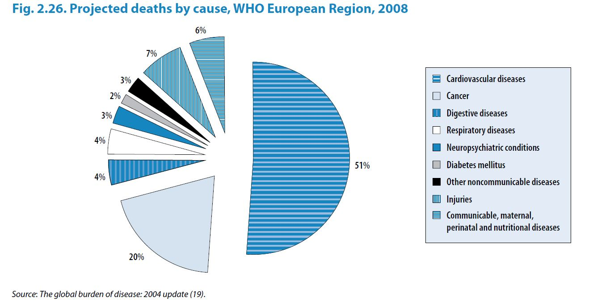{width="90%"}

**Geometric object? Aesthetic attributes? Transformation? Coordinate
system?**

# Advance `ggplot2`

Tuyen Huynh

## Overview

-   What does `mapping = aes()` do?
-   Inheritance of data and aesthetics
-   The `annotate()` layer
-   Splitting up with `facet_wrap()`
-   Extending `ggplot2`
-   Interactive plots with `plotly`

## What does `mapping = aes()` do?

::: fragment
-   `ggplot()` arguments and default values:

``` r
ggplot(data = NULL, mapping = aes(), ...)
```

-   `geom_*()` arguments and default values:

``` r
geom_bar(mapping = NULL, data = NULL, ...)
geom_boxplot(mapping = NULL, data = NULL, ...)
geom_point(mapping = NULL, data = NULL, ...)
```
:::

::: fragment

:::

## What does `mapping = aes()` do? {.scrollable}

::: r-fit-text 

Recall this:

::: fragment
```{r}
df <- read_excel("data/nature_plot.xlsx")
head(df)
```
:::

+------------+------------+------------+------------+-------------+
| label      | x          | y          | size       | color       |
|            |            |            |            |             |
| (country)  | (coverage) |(inequality)|(population)| (region)    |
|            |            |            |            |             |
+============+============+============+============+=============+
| Nigeria    | 0.20       | -0.07      | 220M       | Sub-Saharan |
|            |            |            |            | Africa      |
+------------+------------+------------+------------+-------------+

:::

## What does `mapping = aes()` do?

**Idea**: we are **mapping** the *variables* in the data to the
*aesthetics* of a *geometry*

``` r
aes(x = coverage, y = inequality)
#> Aesthetic mapping: 
#> * `x` -> `coverage`
#> * `y` -> `inequality`
```

<br/>

::: fragment
``` r
aes(x = coverage^2, y = inequality/2)
#> Aesthetic mapping: 
#> * `x` -> `coverage^2`
#> * `y` -> `inequality/2`
```
:::

## What does `mapping = aes()` do?

How do we know which aesthetics does each geometry support? Read the
[documentation](https://ggplot2.tidyverse.org/reference/index.html#geoms){target="_blank"
style="text-decoration: underline;"}!

Simply:

-   Read the documentation of the geometry of interest
-   Click **Aesthetics** on the navigation bar on the right (or scroll
    down)
-   All aesthetics compatible for the geometry are listed

## Inheritance of data and aesthetics

::: fragment
Recall this:

-   `ggplot()` arguments and default values:

``` r
ggplot(data = NULL, mapping = aes(), ...)
```

-   `geom_*()` arguments and default values:

``` r
geom_bar(mapping = NULL, data = NULL, ...)
geom_boxplot(mapping = NULL, data = NULL, ...)
geom_point(mapping = NULL, data = NULL, ...)
```
:::

## Inheritance of data and aesthetics

The idea is that:

-   `ggplot()` can control the **dataset** and **aesthetics**
-   `geom_*()`s can also control the type of **geometries**, and *allow
    customisation* of **aesthetics**

## Inheritance of data and aesthetics

A typical `ggplot` plot will look something like:

``` r
ggplot(plot_df, aes(x = date, y = count)) +
  geom_line() +
  geom_point()
```

::: fragment
Implicitly, you can think of this as:

``` r
ggplot() +
  geom_line(mapping = aes(x = date, y = count), data = plot_df) +
  geom_line(mapping = aes(x = date, y = count), data = plot_df)
```
:::

::: {.fragment .callout-note}
-   We call this **inheritance**
-   Data and aesthetics are inherited **top-down**
:::

## Inheritance of data and aesthetics {auto-animate="true"}

You have seen this in action before!

``` r
cols <- c(
  "Central Europe, Eastern Europe and Central Asia" = "#fa8495",
  "Latin America and Caribbean" = "#4ca258",
  "North Africa and Middle East" = "#6493bb",
  "South Asia" = "#d7c968",
  "Southeast Asia, East Asia and Oceania" = "#7dd8f3",
  "Sub-Saharan Africa" = "#bc5c91"
)

ggplot(df, aes(x = coverage, y = inequality)) +
  geom_point(aes(size = pop, color = region, alpha = 0.8)) +
  geom_text(aes(label = country), hjust = -0.2, vjust = 0.2) +
  geom_vline(xintercept = 0, color = "#999999") +
  geom_hline(yintercept = 0, color = "#999999") +
  scale_x_continuous(breaks = c(-0.25, 0, 0.25, 0.5),
                     limits = c(-0.4, 0.55)) +
  scale_y_continuous(breaks = c(-0.1, 0, 0.1), limits = c(-0.16, 0.1)) +
  scale_size_continuous(
    breaks = c(50, 100, 150, 200),
    labels = c("50 million", "100 million", "150 million", "200 million"),
    range = c(0, 8),
    guide = guide_legend(order = 1)
  ) +
  scale_color_manual(
    values = cols,
    guide = guide_legend(order = 2)
  ) +
  labs(x = "Change in MCV1 coverage (2019-2000)",
       y = "Change in absolute geographical inequality (2019-2000)",
       size = NULL,
       color = NULL) +
  theme_classic() +
  theme(
    legend.position = "top",
    legend.direction = "vertical",
    legend.text = element_text(size = 11),
    legend.key.height = unit(0.5, "cm"),
    axis.text = element_text(size = 11)
  )
```

## Inheritance of data and aesthetics {auto-animate="true"}

``` r
ggplot(df, aes(x = coverage, y = inequality)) +
  geom_point(aes(size = pop, color = region), alpha = 0.8) +
  geom_text(aes(label = country), hjust = -0.2, vjust = 0.2) 
```

```{r}
#| eval: true
#| echo: false
cols <- c(
  "Central Europe, Eastern Europe and Central Asia" = "#fa8495",
  "Latin America and Caribbean" = "#4ca258",
  "North Africa and Middle East" = "#6493bb",
  "South Asia" = "#d7c968",
  "Southeast Asia, East Asia and Oceania" = "#7dd8f3",
  "Sub-Saharan Africa" = "#bc5c91"
)

ggplot(df, aes(x = coverage, y = inequality)) +
  geom_point(aes(size = pop, color = region), alpha = 0.8) +
  geom_text(aes(label = country), hjust = -0.2, vjust = 0.2) +
  geom_vline(xintercept = 0, color = "#999999") +
  geom_hline(yintercept = 0, color = "#999999") +
  scale_x_continuous(breaks = c(-0.25, 0, 0.25, 0.5), limits = c(-0.4, 0.55)) +
  scale_y_continuous(breaks = c(-0.1, 0, 0.1), limits = c(-0.16, 0.1)) +
  scale_size_continuous(
    breaks = c(50, 100, 150, 200),
    labels = c("50 million", "100 million", "150 million", "200 million"),
    range = c(0, 8),
    guide = guide_legend(order = 1)
  ) +
  scale_color_manual(
    values = cols,
    guide = guide_legend(order = 2)
  ) +
  labs(
    x = "Change in MCV1 coverage (2019-2000)",
    y = "Change in absolute geographical inequality (2019-2000)",
    size = NULL,
    color = NULL
  ) +
  theme_classic() +
  theme(
    legend.position = "top",
    legend.direction = "vertical",
    legend.text = element_text(size = 11),
    legend.key.height = unit(0.5, "cm"),
    axis.text = element_text(size = 11)
  )
```

## Inside and outside `aes()`

What happens if we do it like this:

``` r
ggplot(df, aes(x = coverage, y = inequality)) +
  geom_point(aes(size = pop, color = region, alpha = 0.8)) +
  geom_text(aes(label = country, hjust = -0.2, vjust = 0.2)) 
```

```{r}
#| echo: false
cols <- c(
  "Central Europe, Eastern Europe and Central Asia" = "#fa8495",
  "Latin America and Caribbean" = "#4ca258",
  "North Africa and Middle East" = "#6493bb",
  "South Asia" = "#d7c968",
  "Southeast Asia, East Asia and Oceania" = "#7dd8f3",
  "Sub-Saharan Africa" = "#bc5c91"
)

ggplot(df, aes(x = coverage, y = inequality)) +
  geom_point(aes(size = pop, color = region, alpha = 0.8)) +
  geom_text(aes(label = country), hjust = -0.2, vjust = 0.2) +
  geom_vline(xintercept = 0, color = "#999999") +
  geom_hline(yintercept = 0, color = "#999999") +
  scale_x_continuous(breaks = c(-0.25, 0, 0.25, 0.5), limits = c(-0.4, 0.55)) +
  scale_y_continuous(breaks = c(-0.1, 0, 0.1), limits = c(-0.16, 0.1)) +
  scale_size_continuous(
    breaks = c(50, 100, 150, 200),
    labels = c("50 million", "100 million", "150 million", "200 million"),
    range = c(0, 8),
    guide = guide_legend(order = 1)
  ) +
  scale_color_manual(
    values = cols,
    guide = guide_legend(order = 2)
  ) +
  labs(
    x = "Change in MCV1 coverage (2019-2000)",
    y = "Change in absolute geographical inequality (2019-2000)",
    size = NULL,
    color = NULL
  ) +
  theme_classic() +
  theme(
    legend.position = "top",
    legend.direction = "vertical",
    legend.text = element_text(size = 11),
    legend.key.height = unit(0.5, "cm"),
    axis.text = element_text(size = 11)
  )
```

## Inside and outside `aes()` {.scrollable}

::: r-fit-text 

Back to this slide (again):

+------------+------------+------------+------------+-------------+
| label      | x          | y          | size       | color       |
|            |            |            |            |             |
| (country)  | (coverage) |(inequality)|(population)| (region)    |
|            |            |            |            |             |
+============+============+============+============+=============+
| Nigeria    | 0.20       | -0.07      | 220M       | Sub-Saharan |
|            |            |            |            | Africa      |
+------------+------------+------------+------------+-------------+

```{r}
df <- read_excel("data/nature_plot.xlsx")
head(df)
```

:::
## Inside and outside `aes()`

::: callout-important
In short:

-   You want the aesthetics to **change** with the data -\> put it
    **inside** `aes()`\*
-   You want the aesthetics to **be fixed** regardless of data -\> put
    it **outside** `aes()`\*
-   The aesthetics must be supported by the geometry

::: footnote
-   This also means that columns names can only be used inside `aes()`
:::
:::

## Color transparency

In `ggplot2`, you can add transparency to colors with the `alpha`
aesthetics (available for most geometries)

```{r}
#| echo: false
tibble(start_x = 1:10, end_x = 2:11, alphas = seq(0.1, 1, 0.1)) |>
  ggplot() +
  geom_label(aes(label = as.character(alphas), x = (start_x + 0.5), y = 5)) +
  geom_rect(
    aes(xmin = start_x, xmax = end_x, alpha = alphas),
    ymin = 0,
    ymax = 10,
    fill = "blue"
  ) +
  scale_x_continuous("", labels = NULL) +
  scale_y_continuous("", labels = NULL) +
  scale_alpha_continuous(breaks = seq(0.1, 1, 0.1))
```

## The `annotate()` layer {.scrollable}

::: r-fit-text

What if we want to *annotate* specific parts of a figure?

::: fragment
```{r}
#| out-width: "100%"
ggplot(aggregated_cases, aes(x = date_onset, y = case_count)) +
  geom_point(color = "grey") +
  geom_smooth(color = "cornflowerblue", method = "gam") +
  labs(
    title = "New covid cases over time",
    x = "Date",
    y = "Number of cases"
  )
```
:::

:::

## The `annotate()` layer {.scrollable}

::: r-fit-text

Adding a vertical line with `geom_vline()` and a label with
`geom_label()`

::: fragment
```{r}
#| out-width: "100%"
#| code-line-numbers: 6-7
ggplot(aggregated_cases, aes(x = date_onset, y = case_count)) +
  # main plotting geoms
  geom_point(color = "grey") +
  geom_smooth(color = "cornflowerblue", method = "gam") +
  # figure annotation geoms (2)
  geom_vline(xintercept = as.Date("2023-03-01"), linetype = 2) +
  geom_label(label = "Start of outbreak", x = as.Date("2023-03-01"), y = 30) +
  # labels
  labs(
    title = "New covid cases over time",
    x = "Date",
    y = "Number of cases"
  )
```
:::

:::

## The `annotate()` layer {.scrollable}

::: r-fit-text

Adding a region with `geom_rect()` and a label with `geom_label()`

::: fragment
```{r}
#| out-width: "100%"
#| code-line-numbers: 3-8
ggplot(aggregated_cases, aes(x = date_onset, y = case_count)) +
  # figure annotation geoms (1)
  geom_rect(
    ymin = -Inf,
    ymax = Inf,
    xmin = as.Date("2023-04-01"),
    xmax = as.Date("2023-06-01"),
    alpha = 0.2,
    fill = "red"
  ) +
  geom_label(
    label = "Outbreak peak",
    x = as.Date("2023-06-25"),
    y = 30,
    color = "red"
  ) +
  # main plotting geoms
  geom_point(color = "grey") +
  geom_smooth(color = "cornflowerblue", method = "gam") +
  # labels
  labs(
    title = "New covid cases over time",
    x = "Date",
    y = "Number of cases"
  )
```
:::

:::

## The `annotate()` layer {.scrollable}

```{r}
#| echo: false
#| out-width: "100%"
#| code-line-numbers: 3-8
ggplot(aggregated_cases, aes(x = date_onset, y = case_count)) +
  # figure annotation geoms (1)
  geom_rect(
    ymin = -Inf,
    ymax = Inf,
    xmin = as.Date("2023-04-01"),
    xmax = as.Date("2023-06-01"),
    alpha = 0.2,
    fill = "red"
  ) +
  geom_label(
    label = "Outbreak peak",
    x = as.Date("2023-06-25"),
    y = 30,
    color = "red"
  ) +
  # main plotting geoms
  geom_point(color = "grey") +
  geom_smooth(color = "cornflowerblue", method = "gam") +
  # labels
  labs(
    title = "New covid cases over time",
    x = "Date",
    y = "Number of cases"
  )
```

We already said `alpha = 0.2` **outside of `aes()`**, why doesn't it
have any transparency at all??

## The `annotate()` layer {.scrollable}

::: {.fragment .incremental}
-   I lied
-   Aesthetics are always dependant on the dataset, whether it is
    outside or inside `aes()`
:::

## The `annotate()` layer {.scrollable}

Example:

-   Originally the dataset **when used in `ggplot()`** looks like this:

``` r
ggplot(aggregated_cases, ...) + ...
```

```{r}
#| echo: false
aggregated_cases
```

-   When you assigned a fixed value to an aesthetic outside of `aes()`,
    it might look like this:

``` r
ggplot(aggregated_cases, ...) + geom_...(alpha = 0.2)
```

```{r}
#| echo: false
aggregated_cases |> mutate(alpha = 0.2)
```

## The `annotate()` layer {.scrollable}

::: r-fit-text

Using the `annotate()` layer, you can separate the annotations from the
geometry layer

::: fragment
```{r}
#| out-width: "100%"
#| code-line-numbers: 3-8
ggplot(aggregated_cases, aes(x = date_onset, y = case_count)) +
  # figure annotation geoms (1)
  annotate(
    "rect",
    ymin = -Inf,
    ymax = Inf,
    xmin = as.Date("2023-04-01"),
    xmax = as.Date("2023-06-01"),
    alpha = 0.2,
    fill = "red"
  ) +
  annotate(
    "label",
    label = "Outbreak peak",
    x = as.Date("2023-06-25"),
    y = 30,
    color = "red"
  ) +
  # main plotting geoms
  geom_point(color = "grey") +
  geom_smooth(color = "cornflowerblue", method = "gam") +
  # labels
  labs(
    title = "New covid cases over time",
    x = "Date",
    y = "Number of cases"
  )
```
:::

:::


## The `annotate()` layer {.scrollable}

Comparing:

``` r
geom_rect(
  ymin = -Inf, ymax = Inf,
  xmin = as.Date("2023-04-01"), xmax = as.Date("2023-06-01"), 
  alpha = 0.2, fill = "red"
) +
geom_label(label = "Outbreak peak", x = as.Date("2023-06-25"), y = 30, color = "red")
```

vs.

``` r
annotate("rect",
  ymin = -Inf, ymax = Inf,
  xmin = as.Date("2023-04-01"), xmax = as.Date("2023-06-01"), 
  alpha = 0.2, fill = "red"
) +
annotate("label", label = "Outbreak peak", x = as.Date("2023-06-25"), y = 30, color = "red") +
```

## The `annotate()` layer {.scrollable}

::: callout-important
In short:

-   You can create plot annotations with `geom_label()`, `geom_rect()`,
    `geom_abline()`, etc. (look at `ggplot2`
    [website](https://ggplot2.tidyverse.org/))
-   If it's not working correctly (looks blurry, result not as
    expected), use `annotate()` instead; very easy to switch from
    `geom_*()` to `annotate()`
:::

## Splitting up with `facet_wrap()`

::: incremental
-   What if you want to split the plot into different panels for each
    group?
-   Have a look at your data, find a "grouping" variable to split the
    data
:::

## Splitting up with `facet_wrap()` {.scrollable}

::: r-fit-text

-   For example: Split our `simulated_covid` by `outbreak`

::: fragment
```{r}
ggplot(data = simulated_covid, aes(x = date_onset)) +
  geom_bar(fill = "cornflowerblue") +
  facet_wrap(~outbreak)
```
:::

:::


## Splitting up with `facet_wrap()` {.scrollable}

::: r-fit-text

-   Use `facet_wrap()` and add in the variable (with a `~` in the front)

::: fragment
```{r}
#| code-line-number: 3
ggplot(data = simulated_covid, aes(x = date_onset)) +
  geom_bar(fill = "cornflowerblue") +
  facet_wrap(~outbreak)
```
:::

:::

## Splitting up with `facet_wrap()` {.scrollable}

::: r-fit-text

-   You can "free" the scales from their original limits

::: fragment
```{r}
#| code-line-number: 3
ggplot(data = simulated_covid, aes(x = date_onset)) +
  geom_bar(fill = "cornflowerblue") +
  facet_wrap(~outbreak, scales = "free_x")
```
:::

:::

## Splitting up with `facet_wrap()` {.scrollable}

::: r-fit-text

-   You can "free" the scales from their original limits

::: fragment
```{r}
#| code-line-number: 3
ggplot(data = simulated_covid, aes(x = date_onset)) +
  geom_bar(fill = "cornflowerblue") +
  facet_wrap(~outbreak, scales = "free_y")
```
:::

:::

## Extending `ggplot2`

::: incremental
-   Add specific functionalities to `ggplot2` with extensions!
-   How to use:
    -   Think of a specific figure you want to plot
    -   Try your best to plot it with `ggplot2`
    -   If you think `ggplot2` cannot do what you want. Have a look
        [here](https://exts.ggplot2.tidyverse.org/gallery/)
    -   Read their documentation to see how to use them
:::

## Extending `ggplot2`

Some commonly used extensions:

-   `patchwork`: to patch multiple `ggplot2` plots together
-   `gganimate`: to create moving/animating plots
-   `ggrepel`: to repel labels on a plot away from each other
-   `ggdist`: to work with distributions

## Interactive plots with `plotly`

::: r-fit-text

-   If you need to create interactive `ggplot`s, you can use the
    `plotly` package
-   You just need to save your `ggplot` into an object

```{r}
p <- ggplot(aggregated_cases, aes(x = date_onset, y = case_count)) +
  geom_point(color = "grey") +
  geom_smooth(color = "cornflowerblue", method = "gam") +
  labs(
    title = "New covid cases over time",
    x = "Date",
    y = "Number of cases"
  )
```

:::

## Interactive plots with `plotly` {.scrollable}

::: r-fit-text

-   Then use it in the `plotly::ggplotly()` function

```{r}
# install.packages("plotly")
library(plotly)
ggplotly(p)
```

:::

## Interactive plots with `plotly` {.scrollable}

::: r-fit-text

-   You can also create 3d plots with `plotly`

```{r}
plot_ly(
  data = tibble(x = rnorm(10), y = rnorm(10), z = rnorm(10)),
  x = ~x,
  y = ~y,
  z = ~z
)
```

:::
