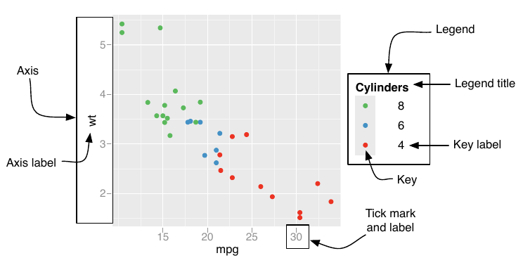

# Introduction

## What to expect

How to make an informative visual representation of data and/or results

- **Part I**: process of graph creation
- **Part II**: principles of graph interpretation

::: callout-note
*Graph* = diagram = chart = figure = picture
:::

## 

::::: columns
::: {.column width="60%"}
{fig-align="left"}
:::

::: {.column .fragment width="40%"}
But it takes

- knowledge of graphics principles
- effort; trial and error
- time

to make a "good" one
:::
:::::

## Who created this graph?

{fig-align="center"}

## Answer: Florence Nightingale

Rose plot to convince UK authorities of importance of hygiene

{fig-align="center"}

## Example of informative graph

{fig-align="center"}

## Example of noninformative graph {.smaller}

[Hinrichsen](https://pubmed.ncbi.nlm.nih.gov/11812878/): risk factors
for hepatitis G infection in haemodialysis patients

- Do we need a graph?

  Are there enough data points to merit a plot?

  - Depends on mode of presentation: conference lecture (time limit),
    article

- If we use a graph, is this one the most truthful and informative?

{fig-align="center" width="300"}

## Graph versus table {.smaller}

Cohort study on 1187 HIV infected persons in The Gambia

::::: columns
::: {.column width="20%"}
{fig-align="center" width="60%"}
:::

::: {.column .fragment width="80%"}
{fig-align="center"}
:::
:::::

## Pattern discovery (fake results)

{fig-align="center"}

## Points to consider

:::::: r-fit-text
- [Why]{style="color:red;"} do we make a graph? (purpose)

  1.  We want to explore and inspect our data or results

  2.  Present data or results, often with a message, to others

::: fragment
- [Where]{style="color:red;"} do we show the graph: research paper,
  conference, website
:::

::: fragment
- [Who]{style="color:red;"} is the audience. Level of background
  knowledge
:::

::: fragment
- [What]{style="color:red;"} do we want to show (data)

  - Graph: visual representation of information ("encoding")

    mapping from data/results to figure
:::
::::::

# The Grammar of Graphics

## The origin

::::: columns
::: {.column width="60%"}
The author

- Leland Wilkinson, *The Grammar of Graphics*, Springer 2005
- Author of SYSTAT; 1995: sold to SPSS
- 1994 - 2007: Senior VP, SPSS
:::

::: {.column width="40%"}
{fig-align="center"}
:::
:::::

## What is a grammar?

::::: columns
::: {.column .incremental width="50%"}
- Defines components of a sentence (verb, noun, ...) and rules how to
  combine them
- Such a sentence *does not* necessarily have to make sense
- **"The lab is flying menacingly"** (Subject + Conjugate + Verb +
  Adverb)
:::

::: {.column .fragment width="50%" style="text-align: center;"}
{height="500"
style="display: block; margin: 0 auto;"} [E.g. this is one grammar rule
of English]{style="font-size: x-large;"}
:::
:::::

## What is a grammar?

- **Graphics** grammar:
  - Defines components of a figure and rules how to combine them
  - Does not advise on the best choice of scale (linear, logarithmic),
    color or line type; one can create noninformative graphs

::: {.fragment .fade-in}
[Grammar helps expressing ideas or information in a clear and coherent
way]{style="color: red;"}
:::

## Grammar of a graph

- A graph maps information (data) to [aesthetic attributes]{.fragment
  .highlight-red fragment-index="1"} of [geometric objects]{.fragment
  .highlight-blue fragment-index="1"}
- [Aesthetic attributes]{.fragment .highlight-red fragment-index="1"}
  are the "role" of variables in plot: location (often along x-axis and
  y-axis), colour, size, shape
- [Geometric objects]{.fragment .highlight-blue fragment-index="1"} are
  the shapes of the data you're visualising, e.g. points, lines, bars

## Scatter plot

::::: columns
::: {.column width="50%"}

:::

::: {.column width="50%"}
- "Mapping routine measles vaccination in low-and middle-income
  countries." *Nature* 589, no. 7842 (2021): 415-419. (IF 2023 = 50.5).

- How do you read this plot?
:::
:::::

## Scatter plot

:::::: columns
::: {.column width="50%"}

:::

:::: {.column width="50%"}
What information would you need to map each point correctly onto this
plot?

::: incremental
- Country name
- Position
- Size
- Color
:::
::::
::::::

## Scatter plot

:::::: columns
::: {.column width="50%"}

:::

:::: {.column width="50%"}
<!-- TODO: which information/data is used for what aes -->

::::
::::::

## Data {.smaller}

+------------+------------+--------------+--------------+-------------+
| label      | x          | y            | size         | color       |
|            |            |              |              |             |
| (country)  | (coverage) | (inequality) | (population) | (region)    |
+============+============+==============+==============+=============+
| Nigeria    | 0.20       | -0.07        | 220M         | Sub-Saharan |
|            |            |              |              | Africa      |
+------------+------------+--------------+--------------+-------------+

Data can be downloaded here:
[nature_plot.xlsx](https://github.com/OUCRU-Modelling/R-training-2025/raw/refs/heads/main/slides/data/nature_plot.xlsx)

```{r}
#| echo: FALSE
library(readxl)
df <- read_excel("data/nature_plot.xlsx")
head(df)
```

## Scatter plot

::::: columns
::: {.column width="50%"}

:::

::: {.column width="50%"}
Let's draw this "by hand"
:::
:::::

## Draw this "by hand"

::::: columns
::: {.column width="50%"}

:::

::: {.column width="50%"}
- Draw the axes
- Draw the data points
- Adjust point sizes
- Colour-code the regions
- Add key country labels
:::
:::::

# We draw this by using...

# `ggplot2`

Use the **Grammar of Graphics** to create elegant data visualisations

::: {.codewindow .r}
code.R

```{r}
#| warning: FALSE
#| message: FALSE
library(ggplot2)
```
:::

## Draw the axes {.smaller}

::::::: columns
::::: {.column width="60%"}
::: {.codewindow .r}
code.R

```{r}
#| eval: FALSE
# df <- ...
ggplot(data = df, mapping = aes(x = coverage, y = inequality))
```
:::

::: fragment
➡ The `x` and `y` aesthetics determine which variable is drawn on each
axis.
:::
:::::

::: {.column width="40%"}
```{r}
#| echo: FALSE
#| fig-width: 5
#| fig-height: 5
#| out-width: "100%"
ggplot(data = df, mapping = aes(x = coverage, y = inequality))
```
:::
:::::::

## Draw the data points {.smaller}

:::::: columns
:::: {.column width="60%"}
::: {.codewindow .r}
code.R

```{r}
#| eval: FALSE
ggplot(data = df, mapping = aes(x = coverage, y = inequality)) +
  geom_point()
```
:::
::::

::: {.column width="40%"}
```{r}
#| echo: FALSE
#| fig-width: 5
#| fig-height: 5
#| out-width: "100%"
ggplot(data = df, mapping = aes(x = coverage, y = inequality)) +
  geom_point()
```
:::
::::::

## Changing the plot orientation {.smaller}

::::::: columns
::::: {.column width="60%"}
::: {.codewindow .r}
code.R

```{r}
#| eval: FALSE
#| code-line-numbers: "1"
ggplot(data = df, mapping = aes(x = inequality, y = coverage)) +
  geom_point()
```
:::

::: fragment
Swapping `x` and `y` aesthetics will change the plot orientation
:::
:::::

::: {.column width="40%"}
```{r}
#| echo: FALSE
#| fig-width: 5
#| fig-height: 5
#| out-width: "100%"
ggplot(df, aes(x = inequality, y = coverage)) +
  geom_point()
```
:::
:::::::

## Adjust point sizes {.smaller}

::::::: columns
::::: {.column width="60%"}
::: {.codewindow .r}
code.R

```{r}
#| eval: FALSE
#| code-line-numbers: "2"
ggplot(data = df, mapping = aes(x = coverage, y = inequality)) +
  geom_point(mapping = aes(size = pop))
```
:::

::: fragment
Observe the 2 `mapping` argument calls, one in `ggplot()` and one in
`geom_point()`
:::
:::::

::: {.column width="40%"}
```{r}
#| echo: FALSE
#| fig-width: 5
#| fig-height: 5
#| out-width: "100%"
ggplot(df, aes(x = coverage, y = inequality)) +
  geom_point(aes(size = pop))
```
:::
:::::::

## Colour-code the regions {.smaller}

:::::: columns
:::: {.column width="60%"}
::: {.codewindow .r}
code.R

```{r}
#| eval: FALSE
#| code-line-numbers: "2"
ggplot(data = df, mapping = aes(x = coverage, y = inequality)) +
  geom_point(mapping = aes(size = pop, color = region))
```
:::
::::

::: {.column width="40%"}
```{r}
#| echo: FALSE
#| fig-width: 5
#| fig-height: 5
#| out-width: "100%"
ggplot(df, aes(x = coverage, y = inequality)) +
  geom_point(aes(size = pop, color = region))
```
:::
::::::

## Setting the theme {.smaller}

::: {.incremental}
- In `ggplot2`, **themes** control the display of all **non-data** elements of the plot
- What are **non-data** elements?
- List of **non-data** elements:
  - titles
  - labels
  - fonts
  - background
  - gridlines
  - legends
:::

## Setting the theme {.smaller}

:::::: columns
:::: {.column width="60%" .incremental}
- Which part of the figure's **theme** do we want to modify?
- Use the [official documentation](https://ggplot2.tidyverse.org/reference/theme.html) to find out how and what can we change
- Quick answer: `theme(legend.position = ...)`
::::

::: {.column width="40%"}
```{r}
#| echo: FALSE
#| fig-width: 5
#| fig-height: 5
#| out-width: "100%"
ggplot(df, aes(x = coverage, y = inequality)) +
  geom_point(aes(size = pop, color = region))
```
:::
::::::

## Setting the theme {.smaller}

:::::: columns
:::: {.column width="60%" .incremental}
::: {.codewindow .r}
code.R

```{r}
#| eval: FALSE
#| code-line-numbers: "3"
ggplot(data = df, mapping = aes(x = coverage, y = inequality)) +
  geom_point(mapping = aes(size = pop, color = region)) +
  theme(legend.position = "top")
```
:::

Moved the legend to the top of the figure
::::

::: {.column width="40%"}
```{r}
#| echo: FALSE
#| fig-width: 5
#| fig-height: 5
#| out-width: "100%"
ggplot(df, aes(x = coverage, y = inequality)) +
  geom_point(aes(size = pop, color = region)) +
  theme(legend.position = "top")
```
:::
::::::

## Setting the theme {.smaller}

:::::: columns
:::: {.column width="60%" .incremental}
::: {.codewindow .r}
code.R

```{r}
#| eval: FALSE
#| code-line-numbers: "3-8"
ggplot(data = df, mapping = aes(x = coverage, y = inequality)) +
  geom_point(mapping = aes(size = pop, color = region)) +
  theme(
    legend.position = "top",
    legend.direction = "vertical",
    legend.text = element_text(size = 11),
    legend.key.height = unit(0.5, "cm")
  )
```
:::

A few more tweaks to make it look nice

Ask your LLM what they mean!
::::

::: {.column width="40%"}
```{r}
#| echo: FALSE
#| fig-width: 5
#| fig-height: 5
#| out-width: "100%"
ggplot(df, aes(x = coverage, y = inequality)) +
  geom_point(aes(size = pop, color = region)) +
  theme(
    legend.position = "top",
    legend.direction = "vertical",
    legend.text = element_text(size = 11),
    legend.key.height = unit(0.5, "cm")
  )
```
:::
::::::

## Add key country labels {.smaller}

:::::: columns
:::: {.column width="60%"}
::: {.codewindow .r}
code.R

```{r}
#| eval: FALSE
#| code-line-numbers: "3"
ggplot(data = df, mapping = aes(x = coverage, y = inequality)) +
  geom_point(mapping = aes(size = pop, color = region)) +
  geom_text(mapping = aes(label = country)) +
  theme(
    legend.position = "top",
    legend.direction = "vertical",
    legend.text = element_text(size = 11),
    legend.key.height = unit(0.5, "cm")
  )
```
:::
::::

::: {.column width="40%"}
```{r}
#| echo: FALSE
#| fig-width: 5
#| fig-height: 5
#| out-width: "100%"
ggplot(df, aes(x = coverage, y = inequality)) +
  geom_point(aes(size = pop, color = region)) +
  geom_text(aes(label = country)) +
  theme(
    legend.position = "top",
    legend.direction = "vertical",
    legend.text = element_text(size = 11),
    legend.key.height = unit(0.5, "cm")
  )
```
:::
::::::

## Compare with the original figure {.smaller}

::::: columns
::: {.column width="50%"}
Original figure 
:::

::: {.column width="50%"}
Ours (so far)

```{r}
#| echo: FALSE
#| fig-width: 5
#| fig-height: 5
#| out-width: "100%"
ggplot(df, aes(x = coverage, y = inequality)) +
  geom_point(aes(size = pop, color = region)) +
  geom_text(aes(label = country)) +
  theme(
    legend.position = "top",
    legend.direction = "vertical",
    legend.text = element_text(size = 11),
    legend.key.height = unit(0.5, "cm")
  )
```
:::
:::::

## Grammar of a graph

- Mapping from information (data) to [aesthetic
  attributes]{style="color: red;"} of [geometric
  objects]{style="color: blue;"}
- [Aesthetic attributes]{style="color: red;"} are the "role" of
  variables in plot: location (often along x-axis and y-axis), colour,
  size, shape
- [Geometric objects]{style="color: blue;"} are what you see on the plot
  (points, lines, bars)

::: fragment
- [Scales]{style="color: orange;"} maps the information (data)
   to [aesthetic attributes]{style="color: red;"}
- [Guides]{style="color: green;"} defines how
  [scales]{style="color: orange;"} are represented
:::

## Scales and guides

- In other words:
  - **Scales** control properties of aesthetics, e.g. x-axis limits, y-axis ticks, point color, point size, line type, etc.
  - **Guides** control the  **figure legends**, where we read data values from the graph

<!-- ::: {.fragment style="text-align: center;"}
Which components are controlled by **scales**? And which are controlled
by **guides**?

{height="300" style="display: block; margin: 0 auto;"}
::: -->

## Scales

- Scales *can* also include statistical transformation(s)!

## Scales: statistical transformation

- **Value transformation** (e.g. linear scale -\> logarithm scale)

- Each **bar in a histogram** can be a "sum" or a
  "percentage/frequency", depending on which statistical
  transformation you want to apply

- A Least Square **Regression line** can be fitted before plotting, this
  also counts as a statistical transformation

## Scales: statistical transformation {.scrollable}

::: callout-important
Statistical transformation(s) on the scales [do
not]{style="color: red;"} change the data, just the scale we use to
observe it
:::

::::: {.columns .fragment}
::: {.column width="50%"}
Linear scale on the x-axis

```{r}
#| echo: FALSE
#| fig-width: 5
#| fig-height: 5
#| out-width: "100%"
ggplot(mtcars) +
  geom_point(aes(x = hp, y = wt, color = as.factor(cyl))) +
  scale_color_discrete("Cylinders")
```
:::

::: {.column width="50%"}
Log-10-scale on the x-axis

```{r}
#| echo: FALSE
#| fig-width: 5
#| fig-height: 5
#| out-width: "100%"
ggplot(mtcars) +
  geom_point(aes(x = hp, y = wt, color = as.factor(cyl))) +
  scale_color_discrete("Cylinders") +
  scale_x_log10()
```
:::
:::::

## Scales and guides {.smaller}

- In summary:
  - **Scales** control properties of aesthetics, e.g. x-axis limits, y-axis ticks, point color, point size, line type, etc.
  - **Guides** control the  **figure legends**, where we read data values from the graph
  - Scales *can* also include statistical transformation(s)

:::::: fragment
- Some other aesthetic attributes that can be controlled with a **scale**: 
  - colour/fill
  - line type
  - geometric object shape
  - geometric object size
::::::

## Refine the plot: the colour scale {.smaller}

:::::: columns
:::: {.column width="60%"}
::: {.codewindow .r}
code.R

```{r default 1}
#| eval: FALSE
ggplot(data = df, mapping = aes(x = coverage, y = inequality)) +
  geom_point(mapping = aes(size = pop, color = region)) +
  geom_text(mapping = aes(label = country)) +
  theme(
    legend.position = "top",
    legend.direction = "vertical",
    legend.text = element_text(size = 11),
    legend.key.height = unit(0.5, "cm")
  )
```
:::
::::

::: {.column width="40%"}
```{r default 2}
#| echo: FALSE
#| fig-width: 5
#| fig-height: 5
#| out-width: "100%"
ggplot(data = df, mapping = aes(x = coverage, y = inequality)) +
  geom_point(mapping = aes(size = pop, color = region)) +
  geom_text(mapping = aes(label = country)) +
  theme(
    legend.position = "top",
    legend.direction = "vertical",
    legend.text = element_text(size = 11),
    legend.key.height = unit(0.5, "cm")
  )
```
:::
::::::

## Refine the plot: the colour scale {.smaller}

:::::: columns
:::: {.column width="60%"}
::: {.codewindow .r}
code.R

```{r}
#| eval: FALSE
#| code-line-numbers: "4-6"
ggplot(data = df, mapping = aes(x = coverage, y = inequality)) +
  geom_point(mapping = aes(size = pop, color = region)) +
  geom_text(mapping = aes(label = country)) +
  scale_color_discrete(
    palette = scales::pal_viridis()
  ) +
  theme(
    legend.position = "top",
    legend.direction = "vertical",
    legend.text = element_text(size = 11),
    legend.key.height = unit(0.5, "cm")
  )
```
:::

Use the built-in Viridis color palette
::::

::: {.column width="40%"}
```{r}
#| echo: FALSE
#| fig-width: 5
#| fig-height: 5
#| out-width: "100%"
ggplot(data = df, mapping = aes(x = coverage, y = inequality)) +
  geom_point(mapping = aes(size = pop, color = region)) +
  geom_text(mapping = aes(label = country)) +
  scale_color_discrete(
    palette = scales::pal_viridis()
  ) +
  theme(
    legend.position = "top",
    legend.direction = "vertical",
    legend.text = element_text(size = 11),
    legend.key.height = unit(0.5, "cm")
  )
```
:::
::::::

## Refine the plot: the colour scale {.smaller}

::::::: columns
::::: {.column width="60%"}
::: {.codewindow .r}
code.R

```{r}
#| eval: FALSE
#| code-line-numbers: "4"
ggplot(data = df, mapping = aes(x = coverage, y = inequality)) +
  geom_point(mapping = aes(size = pop, color = region)) +
  geom_text(mapping = aes(label = country)) +
  scale_color_viridis_d() +
  theme(
    legend.position = "top",
    legend.direction = "vertical",
    legend.text = element_text(size = 11),
    legend.key.height = unit(0.5, "cm")
  )
```
:::

::: {.callout-tip style="font-size:0.7em;"}
You can also use `scale_color_viridis_d()`, which is a shorthand for the
scale layer we used on the previous slide

Breakdown:

- `scale` means we are adding a scale layer
- `_color` means this scale is for the `color` aesthetic (checking your
  `aes()`!)
- `_viridis` defines the color palette
- `_d()` stands for "discrete", so this scale is for a discrete variable
:::
:::::

::: {.column width="40%"}
```{r}
#| echo: FALSE
#| fig-width: 5
#| fig-height: 5
#| out-width: "100%"
ggplot(data = df, mapping = aes(x = coverage, y = inequality)) +
  geom_point(mapping = aes(size = pop, color = region)) +
  geom_text(mapping = aes(label = country)) +
  scale_color_viridis_d() +
  theme(
    legend.position = "top",
    legend.direction = "vertical",
    legend.text = element_text(size = 11),
    legend.key.height = unit(0.5, "cm")
  )
```
:::
:::::::

## Refine the plot: the colour scale {.smaller}


:::::: columns
:::: {.column width="60%"}
::: {.codewindow .r}
code.R

```{r custom 1}
#| eval: FALSE
#| code-line-numbers: "1-8,13"
my_pallete <- c(
  "Central Europe, Eastern Europe and Central Asia" = "#fa8495",
  "Latin America and Caribbean" = "#4ca258",
  "North Africa and Middle East" = "#6493bb",
  "South Asia" = "#d7c968",
  "Southeast Asia, East Asia and Oceania" = "#7dd8f3",
  "Sub-Saharan Africa" = "#bc5c91"
)

ggplot(data = df, mapping = aes(x = coverage, y = inequality)) +
  geom_point(mapping = aes(size = pop, color = region)) +
  geom_text(mapping = aes(label = country)) +
  scale_color_manual(values = my_pallete) +
  theme(
    legend.position = "top",
    legend.direction = "vertical",
    legend.text = element_text(size = 11),
    legend.key.height = unit(0.5, "cm")
  )
```
:::
You can define and use your own custom color palette!
::::

::: {.column width="40%"}
```{r custom 2}
#| echo: FALSE
#| fig-width: 5
#| fig-height: 5
#| out-width: "100%"
my_pallete <- c(
  "Central Europe, Eastern Europe and Central Asia" = "#fa8495",
  "Latin America and Caribbean" = "#4ca258",
  "North Africa and Middle East" = "#6493bb",
  "South Asia" = "#d7c968",
  "Southeast Asia, East Asia and Oceania" = "#7dd8f3",
  "Sub-Saharan Africa" = "#bc5c91"
)

ggplot(data = df, mapping = aes(x = coverage, y = inequality)) +
  geom_point(mapping = aes(size = pop, color = region)) +
  geom_text(mapping = aes(label = country)) +
  scale_color_manual(values = my_pallete) +
  theme(
    legend.position = "top",
    legend.direction = "vertical",
    legend.text = element_text(size = 11),
    legend.key.height = unit(0.5, "cm")
  )
```
:::
::::::

## Refine the plot: the point-size scale {.smaller}

:::::: columns
:::: {.column width="60%"}
::: {.codewindow .r}
code.R

```{r}
#| eval: FALSE
#| code-line-numbers: "14-19"
my_pallete <- c(
  "Central Europe, Eastern Europe and Central Asia" = "#fa8495",
  "Latin America and Caribbean" = "#4ca258",
  "North Africa and Middle East" = "#6493bb",
  "South Asia" = "#d7c968",
  "Southeast Asia, East Asia and Oceania" = "#7dd8f3",
  "Sub-Saharan Africa" = "#bc5c91"
)

ggplot(data = df, mapping = aes(x = coverage, y = inequality)) +
  geom_point(mapping = aes(size = pop, color = region)) +
  geom_text(mapping = aes(label = country)) +
  scale_color_manual(values = my_pallete) +
  scale_size_continuous(
    breaks = c(50, 100, 150, 200),
    labels = c("50 million", "100 million", "150 million", "200 million"),
    range = c(0, 8),
  ) +
  theme(
    legend.position = "top",
    legend.direction = "vertical",
    legend.text = element_text(size = 11),
    legend.key.height = unit(0.5, "cm")
  )
```
:::
::::

::: {.column width="40%"}
```{r}
#| echo: FALSE
#| fig-width: 5
#| fig-height: 5
#| out-width: "100%"
ggplot(data = df, mapping = aes(x = coverage, y = inequality)) +
  geom_point(mapping = aes(size = pop, color = region)) +
  geom_text(mapping = aes(label = country)) +
  scale_color_manual(values = my_pallete) +
  scale_size_continuous(
    breaks = c(50, 100, 150, 200),
    labels = c("50 million", "100 million", "150 million", "200 million"),
    range = c(0, 8),
  ) +
  theme(
    legend.position = "top",
    legend.direction = "vertical",
    legend.text = element_text(size = 11),
    legend.key.height = unit(0.5, "cm")
  )
```
:::
::::::

## Refine the plot: reorder the legends {.smaller}

:::::: columns
:::: {.column width="60%"}
::: {.codewindow .r}
code.R

```{r}
#| eval: FALSE
#| code-line-numbers: "18"
my_pallete <- c(
  "Central Europe, Eastern Europe and Central Asia" = "#fa8495",
  "Latin America and Caribbean" = "#4ca258",
  "North Africa and Middle East" = "#6493bb",
  "South Asia" = "#d7c968",
  "Southeast Asia, East Asia and Oceania" = "#7dd8f3",
  "Sub-Saharan Africa" = "#bc5c91"
)

ggplot(data = df, mapping = aes(x = coverage, y = inequality)) +
  geom_point(mapping = aes(size = pop, color = region)) +
  geom_text(mapping = aes(label = country)) +
  scale_color_manual(values = my_pallete) +
  scale_size_continuous(
    breaks = c(50, 100, 150, 200),
    labels = c("50 million", "100 million", "150 million", "200 million"),
    range = c(0, 8),
    guide = guide_legend(order = 1)
  ) +
  theme(
    legend.position = "top",
    legend.direction = "vertical",
    legend.text = element_text(size = 11),
    legend.key.height = unit(0.5, "cm")
  )
```
:::
::::

::: {.column width="40%"}
```{r}
#| echo: FALSE
#| fig-width: 5
#| fig-height: 5
#| out-width: "100%"
ggplot(data = df, mapping = aes(x = coverage, y = inequality)) +
  geom_point(mapping = aes(size = pop, color = region)) +
  geom_text(mapping = aes(label = country)) +
  scale_color_manual(values = my_pallete) +
  scale_size_continuous(
    breaks = c(50, 100, 150, 200),
    labels = c("50 million", "100 million", "150 million", "200 million"),
    range = c(0, 8),
    guide = guide_legend(order = 1)
  ) +
  theme(
    legend.position = "top",
    legend.direction = "vertical",
    legend.text = element_text(size = 11),
    legend.key.height = unit(0.5, "cm")
  )
```
:::
::::::

## Refine the plot: the axes {.smaller}

:::::: columns
:::: {.column width="60%"}
::: {.codewindow .r}
code.R

```{r}
#| eval: FALSE
#| code-line-numbers: "20-27"
my_pallete <- c(
  "Central Europe, Eastern Europe and Central Asia" = "#fa8495",
  "Latin America and Caribbean" = "#4ca258",
  "North Africa and Middle East" = "#6493bb",
  "South Asia" = "#d7c968",
  "Southeast Asia, East Asia and Oceania" = "#7dd8f3",
  "Sub-Saharan Africa" = "#bc5c91"
)

ggplot(data = df, mapping = aes(x = coverage, y = inequality)) +
  geom_point(mapping = aes(size = pop, color = region)) +
  geom_text(mapping = aes(label = country)) +
  scale_color_manual(values = my_pallete) +
  scale_size_continuous(
    breaks = c(50, 100, 150, 200),
    labels = c("50 million", "100 million", "150 million", "200 million"),
    range = c(0, 8),
    guide = guide_legend(order = 1)
  ) +
  scale_x_continuous(
    breaks = c(-0.25, 0, 0.25, 0.5),
    limits = c(-0.4, 0.55)
  ) +
  scale_y_continuous(
    breaks = c(-0.1, 0, 0.1),
    limits = c(-0.16, 0.1)
  ) +
  theme(
    legend.position = "top",
    legend.direction = "vertical",
    legend.text = element_text(size = 11),
    legend.key.height = unit(0.5, "cm")
  )
```
:::
::::

::: {.column width="40%"}
```{r}
#| echo: FALSE
#| fig-width: 5
#| fig-height: 5
#| out-width: "100%"
ggplot(data = df, mapping = aes(x = coverage, y = inequality)) +
  geom_point(mapping = aes(size = pop, color = region)) +
  geom_text(mapping = aes(label = country)) +
  scale_color_manual(values = my_pallete) +
  scale_size_continuous(
    breaks = c(50, 100, 150, 200),
    labels = c("50 million", "100 million", "150 million", "200 million"),
    range = c(0, 8),
    guide = guide_legend(order = 1)
  ) +
  scale_x_continuous(
    breaks = c(-0.25, 0, 0.25, 0.5),
    limits = c(-0.4, 0.55)
  ) +
  scale_y_continuous(
    breaks = c(-0.1, 0, 0.1),
    limits = c(-0.16, 0.1)
  ) +
  theme(
    legend.position = "top",
    legend.direction = "vertical",
    legend.text = element_text(size = 11),
    legend.key.height = unit(0.5, "cm")
  )
```
:::
::::::

## Refine the plot: labels and theme {.smaller}

:::::: columns
:::: {.column width="60%"}
::: {.codewindow .r}
code.R

```{r}
#| eval: FALSE
#| code-line-numbers: "13-14,18-19,25-26,30-31,35-42"
my_pallete <- c(
  "Central Europe, Eastern Europe and Central Asia" = "#fa8495",
  "Latin America and Caribbean" = "#4ca258",
  "North Africa and Middle East" = "#6493bb",
  "South Asia" = "#d7c968",
  "Southeast Asia, East Asia and Oceania" = "#7dd8f3",
  "Sub-Saharan Africa" = "#bc5c91"
)

ggplot(data = df, mapping = aes(x = coverage, y = inequality)) +
  geom_point(mapping = aes(size = pop, color = region)) +
  geom_text(mapping = aes(label = country)) +
  scale_color_manual(
    name = NULL,
    values = my_pallete,
    guide = guide_legend(order = 2)
  ) +
  scale_size_continuous(
    name = NULL,
    breaks = c(50, 100, 150, 200),
    labels = c("50 million", "100 million", "150 million", "200 million"),
    range = c(0, 8),
    guide = guide_legend(order = 1)
  ) +
  scale_x_continuous(
    name = "Change in MCV1 coverage (2019-2000)",
    breaks = c(-0.25, 0, 0.25, 0.5),
    limits = c(-0.4, 0.55)
  ) +
  scale_y_continuous(
    name = "Change in absolute geographical inequality (2019-2000)",
    breaks = c(-0.1, 0, 0.1),
    limits = c(-0.16, 0.1)
  ) +
  theme_classic() +
  theme(
    legend.position = "top",
    legend.direction = "vertical",
    legend.text = element_text(size = 11),
    legend.key.height = unit(0.5, "cm"),
    axis.text = element_text(size = 11)
  )
```
:::
::::

::: {.column width="40%"}
```{r}
#| echo: FALSE
#| fig-width: 5
#| fig-height: 5
#| out-width: "100%"
ggplot(data = df, mapping = aes(x = coverage, y = inequality)) +
  geom_point(mapping = aes(size = pop, color = region)) +
  geom_text(mapping = aes(label = country)) +
  scale_color_manual(
    name = NULL,
    values = my_pallete,
    guide = guide_legend(order = 2)
  ) +
  scale_size_continuous(
    name = NULL,
    breaks = c(50, 100, 150, 200),
    labels = c("50 million", "100 million", "150 million", "200 million"),
    range = c(0, 8),
    guide = guide_legend(order = 1)
  ) +
  scale_x_continuous(
    name = "Change in MCV1 coverage (2019-2000)",
    breaks = c(-0.25, 0, 0.25, 0.5),
    limits = c(-0.4, 0.55)
  ) +
  scale_y_continuous(
    name = "Change in absolute geographical inequality (2019-2000)",
    breaks = c(-0.1, 0, 0.1),
    limits = c(-0.16, 0.1)
  ) +
  theme_classic() +
  theme(
    legend.position = "top",
    legend.direction = "vertical",
    legend.text = element_text(size = 11),
    legend.key.height = unit(0.5, "cm"),
    axis.text = element_text(size = 11)
  )
```
:::
::::::

## Refine the plot: minor tweaks {.smaller}

:::::: columns
:::: {.column width="60%"}
::: {.codewindow .r}
code.R

```{r}
#| eval: FALSE
#| code-line-numbers: "11-14"
my_pallete <- c(
  "Central Europe, Eastern Europe and Central Asia" = "#fa8495",
  "Latin America and Caribbean" = "#4ca258",
  "North Africa and Middle East" = "#6493bb",
  "South Asia" = "#d7c968",
  "Southeast Asia, East Asia and Oceania" = "#7dd8f3",
  "Sub-Saharan Africa" = "#bc5c91"
)

ggplot(data = df, mapping = aes(x = coverage, y = inequality)) +
  geom_point(mapping = aes(size = pop, color = region), alpha = 0.8) +
  geom_text(mapping = aes(label = country), hjust = -0.2, vjust = 0.2) +
  geom_vline(xintercept = 0, color = "#999999") +
  geom_hline(yintercept = 0, color = "#999999") +
  scale_color_manual(
    name = NULL,
    values = my_pallete,
    guide = guide_legend(order = 2)
  ) +
  scale_size_continuous(
    name = NULL,
    breaks = c(50, 100, 150, 200),
    labels = c("50 million", "100 million", "150 million", "200 million"),
    range = c(0, 8),
    guide = guide_legend(order = 1)
  ) +
  scale_x_continuous(
    name = "Change in MCV1 coverage (2019-2000)",
    breaks = c(-0.25, 0, 0.25, 0.5),
    limits = c(-0.4, 0.55)
  ) +
  scale_y_continuous(
    name = "Change in absolute geographical inequality (2019-2000)",
    breaks = c(-0.1, 0, 0.1),
    limits = c(-0.16, 0.1)
  ) +
  theme_classic() +
  theme(
    legend.position = "top",
    legend.direction = "vertical",
    legend.text = element_text(size = 11),
    legend.key.height = unit(0.5, "cm"),
    axis.text = element_text(size = 11)
  )
```
:::
::::

::: {.column width="40%"}
```{r}
#| echo: FALSE
#| fig-width: 5
#| fig-height: 5
#| out-width: "100%"
ggplot(data = df, mapping = aes(x = coverage, y = inequality)) +
  geom_point(mapping = aes(size = pop, color = region), alpha = 0.8) +
  geom_text(mapping = aes(label = country), hjust = -0.2, vjust = 0.2) +
  geom_vline(xintercept = 0, color = "#999999") +
  geom_hline(yintercept = 0, color = "#999999") +
  scale_color_manual(
    name = NULL,
    values = my_pallete,
    guide = guide_legend(order = 2)
  ) +
  scale_size_continuous(
    name = NULL,
    breaks = c(50, 100, 150, 200),
    labels = c("50 million", "100 million", "150 million", "200 million"),
    range = c(0, 8),
    guide = guide_legend(order = 1)
  ) +
  scale_x_continuous(
    name = "Change in MCV1 coverage (2019-2000)",
    breaks = c(-0.25, 0, 0.25, 0.5),
    limits = c(-0.4, 0.55)
  ) +
  scale_y_continuous(
    name = "Change in absolute geographical inequality (2019-2000)",
    breaks = c(-0.1, 0, 0.1),
    limits = c(-0.16, 0.1)
  ) +
  theme_classic() +
  theme(
    legend.position = "top",
    legend.direction = "vertical",
    legend.text = element_text(size = 11),
    legend.key.height = unit(0.5, "cm"),
    axis.text = element_text(size = 11)
  )
```
:::
::::::

## Refine the plot {.smaller}

::::: columns
::: {.column width="50%"}

:::

::: {.column width="50%"}
```{r}
#| echo: FALSE
#| fig-width: 5.6
#| fig-height: 6.7
#| out-width: "100%"
ggplot(data = df, mapping = aes(x = coverage, y = inequality)) +
  geom_point(mapping = aes(size = pop, color = region), alpha = 0.8) +
  geom_text(mapping = aes(label = country), hjust = -0.2, vjust = 0.2) +
  geom_vline(xintercept = 0, color = "#999999") +
  geom_hline(yintercept = 0, color = "#999999") +
  scale_color_manual(
    name = NULL,
    values = my_pallete,
    guide = guide_legend(order = 2)
  ) +
  scale_size_continuous(
    name = NULL,
    breaks = c(50, 100, 150, 200),
    labels = c("50 million", "100 million", "150 million", "200 million"),
    range = c(0, 8),
    guide = guide_legend(order = 1)
  ) +
  scale_x_continuous(
    name = "Change in MCV1 coverage (2019-2000)",
    breaks = c(-0.25, 0, 0.25, 0.5),
    limits = c(-0.4, 0.55)
  ) +
  scale_y_continuous(
    name = "Change in absolute geographical inequality (2019-2000)",
    breaks = c(-0.1, 0, 0.1),
    limits = c(-0.16, 0.1)
  ) +
  theme_classic() +
  theme(
    legend.position = "top",
    legend.direction = "vertical",
    legend.text = element_text(size = 11),
    legend.key.height = unit(0.5, "cm"),
    axis.text = element_text(size = 11)
  )
```
:::
:::::

## Some frequently used `geom_*`

Histogram and bar charts

::: {.r-fit-text .scrolling style="height: 450px; padding:10px;overflow-y:scroll"}
+--------------------+------------------------+---------------------+
| Geometric object   | Description            | Aesthetics          |
+====================+========================+=====================+
| `geom_histogram()` | Divide continuous `x`  | Required: `x`, and  |
|                    | into bins and count    | `bins` or           |
|                    | observations.          | `binwidth`          |
+--------------------+------------------------+---------------------+
| `geom_col()`       | Bar chart using        | Required: `x`, `y`  |
|                    | provided `x` and `y`   |                     |
|                    | values.                |                     |
+--------------------+------------------------+---------------------+
| `geom_bar()`       | Bar chart with one     | Required: `x` or    |
|                    | axis computed using    | `y`, `stat`         |
|                    | `stat`.                | (default:           |
|                    |                        | `"count"`)          |
+--------------------+------------------------+---------------------+
:::

## Some frequently used `geom_*`

::: r-fit-text
**Example:** For the following examples, we will use the
[simulated_covid.rds](https://github.com/OUCRU-Modelling/R-training-2025/raw/refs/heads/main/slides/data/simulated_covid.rds)
dataset

```{r}
simulated_covid <- readRDS("data/simulated_covid.rds")

head(simulated_covid)
```
:::

## Some frequently used `geom_*`

::::::: r-fit-text
**Example:** creating a bar chart for number of covid incidence over
time

:::::: columns
:::: {.column width="50%"}
::: {.codewindow .r}
code.R

```{r eval=FALSE}
ggplot(
  data = simulated_covid,
  aes(x = date_onset)
) +
  geom_bar(
    color = "cornflowerblue"
  ) +
  scale_x_date("Date") +
  scale_y_continuous("Number of cases") +
  ggtitle("New covid cases over time")
```
:::
::::

::: {.column width="50%"}
```{r echo=FALSE}
#| fig-width: 5
#| fig-height: 5
#| out-width: "100%"
ggplot(
  data = simulated_covid,
  aes(x = date_onset)
) +
  geom_bar(
    color = "cornflowerblue"
  ) +
  scale_x_date("Date") +
  scale_y_continuous("Number of cases") +
  ggtitle("New covid cases over time")
```
:::
::::::
:::::::

## Some frequently used `geom_*`

Scatter plot

::: r-fit-text

+----------------+----------------------------+------------------+
| `geom_*`       | description                | Parameters       |
+================+============================+==================+
| `geom_point()` | Create a scatter plot from | Required         |
|                | given `x` and `y`          | aesthetic: `x`   |
|                |                            | and `y`          |
+----------------+----------------------------+------------------+

:::

## Some frequently used `geom_*`

::::::: r-fit-text
**Example:** creating a scatter plot for number of covid incidence over
time

:::::: columns
:::: {.column width="50%"}
::: {.codewindow .r}
code.R

```{r eval=FALSE}
library(dplyr)
# we need to compute y
# (case_count before plotting)
aggregated_cases <- simulated_covid |>
  group_by(date_onset) |>
  summarise(
    case_count = n()
  )

ggplot(
  aggregated_cases,
  aes(x = date_onset, y = case_count)
) +
  geom_point(
    color = "cornflowerblue"
  ) +
  scale_x_date("Date") +
  scale_y_continuous("Number of cases") +
  ggtitle("New covid cases over time")
```
:::
::::

::: {.column width="50%"}
```{r echo=FALSE}
#| fig-width: 5
#| fig-height: 5
#| out-width: "100%"
library(dplyr)
# we need to compute y (case_count before plotting)
aggregated_cases <- simulated_covid |>
  group_by(date_onset) |>
  summarise(
    case_count = n()
  )

ggplot(
  aggregated_cases,
  aes(x = date_onset, y = case_count)
) +
  geom_point(
    color = "cornflowerblue"
  ) +
  scale_x_date("Date") +
  scale_y_continuous("Number of cases") +
  ggtitle("New covid cases over time")
```
:::
::::::
:::::::

## Some frequently used `geom_*`

Line chart

::: r-fit-text

+-----------------+--------------+----------------------------------------------------+
| `geom_*`        | description  | Parameters                                         |
+=================+==============+====================================================+
| `geom_line()`   | Create a     | Required aesthetic: `x` and `y`                    |
|                 | line plot    |                                                    |
|                 | from given   |                                                    |
|                 | `x` and `y`  |                                                    |
+-----------------+--------------+----------------------------------------------------+
| `geom_smooth()` | Create a     | Required aesthetic: `x` and `y`                    |
|                 | regression   |                                                    |
|                 | line plot    | - `method`: select regression model                |
|                 | from `x` and |   (`"auto"`, `" lm"`, `"glm"`, `"gam"`, `"loess"`) |
|                 | `y`          |                                                    |
|                 |              | - `formula`: adjust the formula for the regression |
|                 |              |   model                                            |
+-----------------+--------------+----------------------------------------------------+

:::

## Some frequently used `geom_*`

::::::: r-fit-text
**Example:** creating a line chart for number of covid incidence over
time

:::::: columns
:::: {.column width="50%"}
::: {.codewindow .r}
code.R

```{r eval=FALSE}
ggplot(
  aggregated_cases,
  aes(x = date_onset, y = case_count)
) +
  geom_line(
    color = "cornflowerblue"
  ) +
  scale_x_date("Date") +
  scale_y_continuous("Number of cases") +
  ggtitle("New covid cases over time")
```
:::
::::

::: {.column width="50%"}
```{r echo=FALSE}
#| fig-width: 5
#| fig-height: 5
#| out-width: "100%"
ggplot(
  aggregated_cases,
  aes(x = date_onset, y = case_count)
) +
  geom_line(
    color = "cornflowerblue"
  ) +
  scale_x_date("Date") +
  scale_y_continuous("Number of cases") +
  ggtitle("New covid cases over time")
```
:::
::::::
:::::::

## Some frequently used `geom_*`

::::::: r-fit-text
**Example:** add a regression line for number of covid incidence over
time

:::::: columns
:::: {.column width="50%"}
::: {.codewindow .r}
code.R

```{r eval=FALSE}
ggplot(
  aggregated_cases,
  aes(x = date_onset, y = case_count)
) +
  geom_point(
    color = "grey"
  ) +
  geom_smooth(
    color = "cornflowerblue",
    # choose gam model to fit the data
    method = "gam"
  ) +
  scale_x_date("Date") +
  scale_y_continuous("Number of cases") +
  ggtitle("New covid cases over time")
```
:::
::::

::: {.column width="50%"}
```{r echo=FALSE}
#| fig-width: 5
#| fig-height: 5
#| out-width: "100%"
ggplot(
  aggregated_cases,
  aes(x = date_onset, y = case_count)
) +
  geom_point(
    color = "grey"
  ) +
  geom_smooth(
    color = "cornflowerblue",
    method = "gam" # choose gam model to fit the data
  ) +
  scale_x_date("Date") +
  scale_y_continuous("Number of cases") +
  ggtitle("New covid cases over time")
```
:::
::::::
:::::::

## Some frequently used `geom_*`

::: r-fit-text
Box plot

+-------------------+---------------------------------+-----------------+
| `geom_*`          | description                     | Parameters      |
+===================+=================================+=================+
| `geom_boxplot()`  | Create a boxplot from a         | Required        |
|                   | continuous variable.            | aesthetic: `x`  |
|                   |                                 | [or]{.underline}|
|                   | If both `x` and `y` are given,  | `y`             |
|                   | one must be a categorical       |                 |
|                   | variable (in which case a       |                 |
|                   | boxplot is created for each     |                 |
|                   | category)                       |                 |
+-------------------+---------------------------------+-----------------+
:::

## Some frequently used `geom_*`

::::::: r-fit-text
**Example:** create a box plot to compare number of cases per day
between 2 outbreaks

:::::: columns
:::: {.column width="50%"}
::: {.codewindow .r}
code.R

```{r eval=FALSE}
# compute cases per day for each outbreak
cases_per_outbreak <- simulated_covid |>
  group_by(date_onset, outbreak) |>
  summarise(
    case_count = n()
  )

ggplot(
  cases_per_outbreak,
  aes(x = case_count, y = outbreak)
) +
  geom_boxplot() +
  scale_x_continuous("Number of daily cases") +
  scale_y_discrete("Outbreak") +
  ggtitle("Compare distribution of daily cases between 2 outbreaks")
```
:::
::::

::: {.column width="50%"}
```{r echo=FALSE}
#| fig-width: 5
#| fig-height: 5
#| out-width: "100%"
simulated_covid |>
  group_by(date_onset, outbreak) |>
  summarise(
    case_count = n()
  ) |>
  ggplot(
    aes(x = case_count, y = outbreak)
  ) +
  geom_boxplot() +
  scale_x_continuous("Number of daily cases") +
  scale_y_discrete("Outbreak") +
  ggtitle("Compare distribution of daily cases between 2 outbreaks")
```
:::
::::::
:::::::

## Read the docs!

- For a complete list of `geom_*`, refer to [`ggplot2` official
documentation](https://ggplot2.tidyverse.org/reference/index.html#geom){preview-link="true"}

- How do we know which aesthetics does each geometry support? Read the [documentation](https://ggplot2.tidyverse.org/reference/index.html#geoms){style="text-decoration: underline;"}!


- Alternatively, you can also look for the example code for your desired
chart type at [R Graph
Gallery](https://r-graph-gallery.com){preview-link="true"}

## Save plot

Function `ggsave()` is used for saving plots with the following key
parameters

- `plot` select plot to save (default to the last generated plot)

- `filename` name of the saved file

- `path` path to the directory where the plot is stored

- `width`, `height` plot size in units expressed by the `units` argument

- `dpi` plot resolution

## Save plot

**Example**: save the last generated plot

```{r eval=FALSE}
ggsave(
  path = "plots", # save plot under plots directory
  filename = "new_plot.png",
  width = 800,
  height = 600, # adjust plot size in pixel
  units = "px",
  dpi = 200 # set resolution
)
```

## Export: two types of formats

- Vector format (e.g. `.svg`, `.eps`)
  - Consists of independent geometric objects (segments,
    polygons, curves, etc.)
  - Can be enlarged without losing resolution
- Raster format (e.g. `.png`, `.jpeg`/`.jpg`, `.tiff`).
  - Rectangular grid of pixels, possibly with color
  - Will be very blurry if image is enlarged while resolution is low

## Grammar of a graph {.smaller}

- Mapping from information (data) to **aesthetic attributes** of **geometric objects**
- **Aesthetic attributes** are the "role" of
  variables in plot: location (often along x-axis and y-axis), colour,
  size, shape
- **Geometric objects** are what you see on the plot
  (points, lines, bars)
- **Scales** maps the information (data)
   to **aesthetic attributes**
- **Guides** defines how
  **scales** are represented

:::: fragment
- [Coordinate system]{style="color:red;"}: cartesian, polar, map
  projections

::: {.callout-note}
  Networks, trees have no coordinate system
:::
::::

## Polar coordinate system

Pie chart WHO European Health Report 2009

{width="90%"}

**Geometric object? Aesthetic attributes? Transformation? Coordinate
system?**

## Grammar of a graph

- The grammar of graphics [**is not**]{style="color: red;"} about **deciding** the [type of graphics](https://www.data-to-viz.com/) for your data
- We are the decision makers. The grammar of graphics just provide the common language, e.g. knowing English and knowing what to say are 2 different things!

# Advance `ggplot2`

## Overview

- Inheritance of data and aesthetics
- The `annotate()` layer
- Figure panes using `facet_wrap()`
- Extending `ggplot2`
- Interactive plots with `plotly`

## Inheritance of data and aesthetics {.smaller}

::: fragment
Recall this:

- `ggplot()` arguments and default values:

```{.r}
ggplot(data = NULL, mapping = aes(), ...)
```

- `geom_*()` arguments and default values:

```{.r}
geom_bar(mapping = NULL, data = NULL, ...)
geom_boxplot(mapping = NULL, data = NULL, ...)
geom_point(mapping = NULL, data = NULL, ...)
```
:::

## Inheritance of data and aesthetics

The idea is that:

- `ggplot()` control the **dataset** and **aesthetics**
- `geom_*()`s control the **geometric layer**, and *allow
  customisation* of **aesthetics** for that specific geom layer

## Inheritance of data and aesthetics {.smaller}

A typical `ggplot` plot will look something like:

```{.r}
ggplot(plot_df, aes(x = date, y = count)) +
  geom_line() +
  geom_point()
```

::: fragment
Implicitly, you can think of this as:

```{.r}
ggplot() +
  geom_line(mapping = aes(x = date, y = count), data = plot_df) +
  geom_line(mapping = aes(x = date, y = count), data = plot_df)
```
:::

::: {.fragment .callout-note}
- We call this **inheritance**
- Data and aesthetics are inherited **top-down**
:::

## Inheritance of data and aesthetics {.smaller auto-animate="true"}

Our final figure this morning:

```{.r}
ggplot(data = df, mapping = aes(x = coverage, y = inequality)) +
  geom_point(mapping = aes(size = pop, color = region), alpha = 0.8) +
  geom_text(mapping = aes(label = country), hjust = -0.2, vjust = 0.2) +
  geom_vline(xintercept = 0, color = "#999999") +
  geom_hline(yintercept = 0, color = "#999999") +
  scale_color_manual(
    name = NULL,
    values = my_pallete,
    guide = guide_legend(order = 2)
  ) +
  scale_size_continuous(
    name = NULL,
    breaks = c(50, 100, 150, 200),
    labels = c("50 million", "100 million", "150 million", "200 million"),
    range = c(0, 8),
    guide = guide_legend(order = 1)
  ) +
  scale_x_continuous(
    name = "Change in MCV1 coverage (2019-2000)",
    breaks = c(-0.25, 0, 0.25, 0.5),
    limits = c(-0.4, 0.55)
  ) +
  scale_y_continuous(
    name = "Change in absolute geographical inequality (2019-2000)",
    breaks = c(-0.1, 0, 0.1),
    limits = c(-0.16, 0.1)
  ) +
  theme_classic() +
  theme(
    legend.position = "top",
    legend.direction = "vertical",
    legend.text = element_text(size = 11),
    legend.key.height = unit(0.5, "cm"),
    axis.text = element_text(size = 11)
  )
```

## Inheritance of data and aesthetics {.smaller auto-animate="true"}

Focus on this chunk

```{.r}
ggplot(data = df, mapping = aes(x = coverage, y = inequality)) +
  geom_point(mapping = aes(size = pop, color = region), alpha = 0.8) +
  geom_text(mapping = aes(label = country), hjust = -0.2, vjust = 0.2) +
```

```{r}
#| eval: true
#| echo: false
ggplot(df, aes(x = coverage, y = inequality)) +
  geom_point(aes(size = pop, color = region), alpha = 0.8) +
  geom_text(aes(label = country), hjust = -0.2, vjust = 0.2) +
  geom_vline(xintercept = 0, color = "#999999") +
  geom_hline(yintercept = 0, color = "#999999") +
  scale_x_continuous(breaks = c(-0.25, 0, 0.25, 0.5), limits = c(-0.4, 0.55)) +
  scale_y_continuous(breaks = c(-0.1, 0, 0.1), limits = c(-0.16, 0.1)) +
  scale_size_continuous(
    breaks = c(50, 100, 150, 200),
    labels = c("50 million", "100 million", "150 million", "200 million"),
    range = c(0, 8),
    guide = guide_legend(order = 1)
  ) +
  scale_color_manual(
    values = my_pallete,
    guide = guide_legend(order = 2)
  ) +
  labs(
    x = "Change in MCV1 coverage (2019-2000)",
    y = "Change in absolute geographical inequality (2019-2000)",
    size = NULL,
    color = NULL
  ) +
  theme_classic() +
  theme(
    legend.position = "top",
    legend.direction = "vertical",
    legend.text = element_text(size = 11),
    legend.key.height = unit(0.5, "cm"),
    axis.text = element_text(size = 11)
  )
```

## Inside and outside `aes()` {.smaller}

What happens if we do it like this:

```{.r}
ggplot(data = df, mapping = aes(x = coverage, y = inequality)) +
  geom_point(mapping = aes(size = pop, color = region, alpha = 0.8)) +
  geom_text(mapping = aes(label = country, hjust = -0.2, vjust = 0.2)) +
```

```{r}
#| echo: false
ggplot(data = df, mapping = aes(x = coverage, y = inequality)) +
  geom_point(mapping = aes(size = pop, color = region, alpha = 0.8)) +
  geom_text(mapping = aes(label = country, hjust = -0.2, vjust = 0.2)) +
  geom_vline(xintercept = 0, color = "#999999") +
  geom_hline(yintercept = 0, color = "#999999") +
  scale_x_continuous(breaks = c(-0.25, 0, 0.25, 0.5), limits = c(-0.4, 0.55)) +
  scale_y_continuous(breaks = c(-0.1, 0, 0.1), limits = c(-0.16, 0.1)) +
  scale_size_continuous(
    breaks = c(50, 100, 150, 200),
    labels = c("50 million", "100 million", "150 million", "200 million"),
    range = c(0, 8),
    guide = guide_legend(order = 1)
  ) +
  scale_color_manual(
    values = my_pallete,
    guide = guide_legend(order = 2)
  ) +
  labs(
    x = "Change in MCV1 coverage (2019-2000)",
    y = "Change in absolute geographical inequality (2019-2000)",
    size = NULL,
    color = NULL
  ) +
  theme_classic() +
  theme(
    legend.position = "top",
    legend.direction = "vertical",
    legend.text = element_text(size = 11),
    legend.key.height = unit(0.5, "cm"),
    axis.text = element_text(size = 11)
  )
```

## Inside and outside `aes()` {.scrollable .smaller}

::: r-fit-text
Back to this slide (again):

+------------+------------+--------------+--------------+-------------+
| label      | x          | y            | size         | color       |
|            |            |              |              |             |
| (country)  | (coverage) | (inequality) | (population) | (region)    |
+============+============+==============+==============+=============+
| Nigeria    | 0.20       | -0.07        | 220M         | Sub-Saharan |
|            |            |              |              | Africa      |
+------------+------------+--------------+--------------+-------------+

```{r}
df <- read_excel("data/nature_plot.xlsx")
head(df)
```
:::

## Inside and outside `aes()`

:::: callout-important
In short:

- You want the aesthetics to **change** with the data -\> put it
  **inside** `aes()`\*
- You want the aesthetics to **be fixed** regardless of data -\> put it
  **outside** `aes()`\*
- The aesthetics must be supported by the geometric objects

::::
::: callout-warning
- This also means that columns names can only be used inside `aes()`
:::

## Color transparency {.smaller}

In `ggplot2`, you can add transparency to colors with the `alpha`
aesthetics (available for most geometric objects)

:::: {.columns}

::: {.column width="50%"}

```{.r}
tibble(start_x = 1:10, end_x = 2:11, alphas = seq(0.1, 1, 0.1)) |>
  ggplot() +
  geom_label(aes(label = as.character(alphas), x = (start_x + 0.5), y = 5)) +
  geom_rect(
    aes(xmin = start_x, xmax = end_x, alpha = alphas),
    ymin = 0,
    ymax = 10,
    fill = "blue"
  ) +
  scale_x_continuous(name = NULL, labels = NULL) +
  scale_y_continuous(name = NULL, labels = NULL) +
  scale_alpha_continuous(breaks = seq(0.1, 1, 0.1))
```

:::

::: {.column width="50%"}
```{r}
#| echo: FALSE
#| out-width: "100%"
tibble(start_x = 1:10, end_x = 2:11, alphas = seq(0.1, 1, 0.1)) |>
  ggplot() +
  geom_label(aes(label = as.character(alphas), x = (start_x + 0.5), y = 5)) +
  geom_rect(
    aes(xmin = start_x, xmax = end_x, alpha = alphas),
    ymin = 0,
    ymax = 10,
    fill = "blue"
  ) +
  scale_x_continuous(name = NULL, labels = NULL) +
  scale_y_continuous(name = NULL, labels = NULL) +
  scale_alpha_continuous(breaks = seq(0.1, 1, 0.1))
```
:::

::::

## The `annotate()` layer

How to *annotate* specific parts of a figure?

:::: {.columns}
::: {.column width="50%"}

```{.r}
ggplot(aggregated_cases, aes(x = date_onset, y = case_count)) +
  geom_point(color = "grey") +
  geom_smooth(color = "cornflowerblue", method = "gam") +
  labs(
    title = "New covid cases over time",
    x = "Date",
    y = "Number of cases"
  )
```
:::

::: {.column width="50%"}
```{r}
#| echo: FALSE
#| out-width: "100%"
ggplot(aggregated_cases, aes(x = date_onset, y = case_count)) +
  geom_point(color = "grey") +
  geom_smooth(color = "cornflowerblue", method = "gam") +
  labs(
    title = "New covid cases over time",
    x = "Date",
    y = "Number of cases"
  )
```
:::

::::

## The `annotate()` layer

Adding a vertical line with `geom_vline()` and a label with `geom_label()`

:::: {.columns}

::: {.column width="50%"}

```{r}
#| eval: FALSE
#| code-line-numbers: 6-7
ggplot(aggregated_cases, aes(x = date_onset, y = case_count)) +
  # main plotting geoms
  geom_point(color = "grey") +
  geom_smooth(color = "cornflowerblue", method = "gam") +
  # figure annotation geoms (2)
  geom_vline(xintercept = as.Date("2023-03-01"), linetype = 2) +
  geom_label(label = "Start of outbreak", x = as.Date("2023-03-01"), y = 30) +
  # labels
  labs(
    title = "New covid cases over time",
    x = "Date",
    y = "Number of cases"
  )
```
:::

::: {.column width="50%"}
```{r}
#| echo: FALSE
#| out-width: "100%"
ggplot(aggregated_cases, aes(x = date_onset, y = case_count)) +
  # main plotting geoms
  geom_point(color = "grey") +
  geom_smooth(color = "cornflowerblue", method = "gam") +
  # figure annotation geoms (2)
  geom_vline(xintercept = as.Date("2023-03-01"), linetype = 2) +
  geom_label(label = "Start of outbreak", x = as.Date("2023-03-01"), y = 30) +
  # labels
  labs(
    title = "New covid cases over time",
    x = "Date",
    y = "Number of cases"
  )
```
:::
::::

## The `annotate()` layer {.scrollable}

Annotate a time range with `geom_rect()` and a label with `geom_label()`

:::: {.columns}

::: {.column width="50%"}
```{r}
#| eval: FALSE
#| code-line-numbers: 3-10
ggplot(aggregated_cases, aes(x = date_onset, y = case_count)) +
  # figure annotation geoms (1)
  geom_rect(
    ymin = -Inf,
    ymax = Inf,
    xmin = as.Date("2023-04-01"),
    xmax = as.Date("2023-06-01"),
    alpha = 0.2,
    fill = "red"
  ) +
  geom_label(
    label = "Outbreak peak",
    x = as.Date("2023-06-25"),
    y = 30,
    color = "red"
  ) +
  # main plotting geoms
  geom_point(color = "grey") +
  geom_smooth(color = "cornflowerblue", method = "gam") +
  # labels
  labs(
    title = "New covid cases over time",
    x = "Date",
    y = "Number of cases"
  )
```
:::

::: {.column width="50%"}
```{r}
#| echo: FALSE
#| out-width: "100%"
ggplot(aggregated_cases, aes(x = date_onset, y = case_count)) +
  # figure annotation geoms (1)
  geom_rect(
    ymin = -Inf,
    ymax = Inf,
    xmin = as.Date("2023-04-01"),
    xmax = as.Date("2023-06-01"),
    alpha = 0.2,
    fill = "red"
  ) +
  geom_label(
    label = "Outbreak peak",
    x = as.Date("2023-06-25"),
    y = 30,
    color = "red"
  ) +
  # main plotting geoms
  geom_point(color = "grey") +
  geom_smooth(color = "cornflowerblue", method = "gam") +
  # labels
  labs(
    title = "New covid cases over time",
    x = "Date",
    y = "Number of cases"
  )
```
:::
::::

## The `annotate()` layer {.scrollable}

```{r}
#| echo: false
#| out-width: "100%"
#| code-line-numbers: 3-8
ggplot(aggregated_cases, aes(x = date_onset, y = case_count)) +
  # figure annotation geoms (1)
  geom_rect(
    ymin = -Inf,
    ymax = Inf,
    xmin = as.Date("2023-04-01"),
    xmax = as.Date("2023-06-01"),
    alpha = 0.2,
    fill = "red"
  ) +
  geom_label(
    label = "Outbreak peak",
    x = as.Date("2023-06-25"),
    y = 30,
    color = "red"
  ) +
  # main plotting geoms
  geom_point(color = "grey") +
  geom_smooth(color = "cornflowerblue", method = "gam") +
  # labels
  labs(
    title = "New covid cases over time",
    x = "Date",
    y = "Number of cases"
  )
```

We already put `alpha = 0.2` **outside of `aes()`**, why doesn't it
have any transparency at all??

## The `annotate()` layer {.scrollable}

::: {.fragment .incremental}
- Well ackshually... ☝️🤓
- Aesthetics are always dependant on the dataset, whether it is outside
  or inside `aes()`!
:::

## The `annotate()` layer {.scrollable .smaller}

Example:

- Originally the dataset **when used in `ggplot()`** looks like this:

```{.r}
ggplot(aggregated_cases, ...) + ...
```

```{r}
#| echo: false
aggregated_cases
```

- When you assigned a fixed value to an aesthetic outside of `aes()`, it
  will look like this:

```{.r}
ggplot(aggregated_cases, ...) + geom_...(alpha = 0.2)
```

```{r}
#| echo: false
aggregated_cases |> mutate(alpha = 0.2)
```

## The `annotate()` layer {.scrollable}

:::: {.columns}
Using the `annotate()` layer, you can separate the annotations from the
geometry layer

::: {.column width="50%"}
```{r}
#| eval: FALSE
#| code-line-numbers: 3-11
ggplot(aggregated_cases, aes(x = date_onset, y = case_count)) +
  # figure annotation geoms (1)
  annotate(
    "rect",
    ymin = -Inf,
    ymax = Inf,
    xmin = as.Date("2023-04-01"),
    xmax = as.Date("2023-06-01"),
    alpha = 0.2,
    fill = "red"
  ) +
  annotate(
    "label",
    label = "Outbreak peak",
    x = as.Date("2023-06-25"),
    y = 30,
    color = "red"
  ) +
  # main plotting geoms
  geom_point(color = "grey") +
  geom_smooth(color = "cornflowerblue", method = "gam") +
  # labels
  labs(
    title = "New covid cases over time",
    x = "Date",
    y = "Number of cases"
  )
```

:::

::: {.column width="50%"}
```{r}
#| echo: FALSE
#| out-width: "100%"
ggplot(aggregated_cases, aes(x = date_onset, y = case_count)) +
  # figure annotation geoms (1)
  annotate(
    "rect",
    ymin = -Inf,
    ymax = Inf,
    xmin = as.Date("2023-04-01"),
    xmax = as.Date("2023-06-01"),
    alpha = 0.2,
    fill = "red"
  ) +
  annotate(
    "label",
    label = "Outbreak peak",
    x = as.Date("2023-06-25"),
    y = 30,
    color = "red"
  ) +
  # main plotting geoms
  geom_point(color = "grey") +
  geom_smooth(color = "cornflowerblue", method = "gam") +
  # labels
  labs(
    title = "New covid cases over time",
    x = "Date",
    y = "Number of cases"
  )
```
:::
::::

## The `annotate()` layer {.scrollable}

Comparing:

```{.r}
geom_rect(
  ymin = -Inf, ymax = Inf,
  xmin = as.Date("2023-04-01"), xmax = as.Date("2023-06-01"), 
  alpha = 0.2, fill = "red"
) +
geom_label(label = "Outbreak peak", x = as.Date("2023-06-25"), y = 30, color = "red")
```

vs.

```{.r}
annotate("rect",
  ymin = -Inf, ymax = Inf,
  xmin = as.Date("2023-04-01"), xmax = as.Date("2023-06-01"), 
  alpha = 0.2, fill = "red"
) +
annotate("label", label = "Outbreak peak", x = as.Date("2023-06-25"), y = 30, color = "red") +
```

## The `annotate()` layer {.scrollable}

::: callout-important
In short:

- You can create plot annotations with `geom_label()`, `geom_rect()`,
  `geom_abline()`, etc. (look at `ggplot2`
  [website](https://ggplot2.tidyverse.org/))
- If it's not working correctly (looks blurry, result not as expected),
  use `annotate()` instead; very easy to switch from `geom_*()` to
  `annotate()`
:::

## Splitting up with `facet_wrap()`

::: incremental
- What if you want to split the plot into different panels for each
  group?
- Have a look at your data, find a "grouping" variable to split the data
:::

## Splitting up with `facet_wrap()` {.scrollable}

:::: r-fit-text
- For example: Split our `simulated_covid` by `outbreak`

::: fragment
```{r}
ggplot(data = simulated_covid, aes(x = date_onset)) +
  geom_bar(fill = "cornflowerblue") +
  facet_wrap(~outbreak)
```
:::
::::

## Splitting up with `facet_wrap()` {.scrollable}

:::: r-fit-text
- Use `facet_wrap()` and add in the variable (with a `~` in the front)

::: fragment
```{r}
#| code-line-number: 3
ggplot(data = simulated_covid, aes(x = date_onset)) +
  geom_bar(fill = "cornflowerblue") +
  facet_wrap(~outbreak)
```
:::
::::

## Splitting up with `facet_wrap()` {.scrollable}

:::: r-fit-text
- You can "free" the scales from their original limits

::: fragment
```{r}
#| code-line-number: 3
ggplot(data = simulated_covid, aes(x = date_onset)) +
  geom_bar(fill = "cornflowerblue") +
  facet_wrap(~outbreak, scales = "free_x")
```
:::
::::

## Splitting up with `facet_wrap()` {.scrollable}

:::: r-fit-text
- You can "free" the scales from their original limits

::: fragment
```{r}
#| code-line-number: 3
ggplot(data = simulated_covid, aes(x = date_onset)) +
  geom_bar(fill = "cornflowerblue") +
  facet_wrap(~outbreak, scales = "free_y")
```
:::
::::

## Extending `ggplot2`

::: incremental
- Add specific functionalities to `ggplot2` with extensions!
- How to use:
  - Think of a specific figure you want to plot
  - Try your best to plot it with `ggplot2`
  - If you think `ggplot2` cannot do what you want. Have a look
    [here](https://exts.ggplot2.tidyverse.org/gallery/)
  - Read their documentation to see how to use them
:::

## Extending `ggplot2`

Some commonly used extensions:

- `patchwork`: to patch multiple `ggplot2` plots together
- `gganimate`: to create moving/animating plots
- `ggrepel`: to repel labels on a plot away from each other
- `ggdist`: to work with distributions

## Interactive plots with `plotly`

::: r-fit-text
- If you need to create interactive `ggplot`s, you can use the `plotly`
  package
- You just need to save your `ggplot` into an object

```{r}
p <- ggplot(aggregated_cases, aes(x = date_onset, y = case_count)) +
  geom_point(color = "grey") +
  geom_smooth(color = "cornflowerblue", method = "gam") +
  labs(
    title = "New covid cases over time",
    x = "Date",
    y = "Number of cases"
  )
```
:::

## Interactive plots with `plotly` {.scrollable}

::: r-fit-text
- Then use it in the `plotly::ggplotly()` function

```{r}
# install.packages("plotly")
library(plotly)
ggplotly(p)
```
:::

## Interactive plots with `plotly` {.scrollable}

::: r-fit-text
- You can also create 3d plots with `plotly`

```{r}
plot_ly(
  data = tibble(x = rnorm(10), y = rnorm(10), z = rnorm(10)),
  x = ~x,
  y = ~y,
  z = ~z
)
```
:::